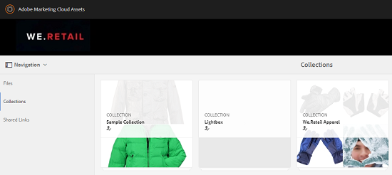

# Publicar coleções no Brand Portal {#publish-collections-to-brand-portal}

Como administrador do Adobe Experience Manager (AEM) Assets, você pode publicar coleções na instância do AEM Assets Brand Portal para sua organização. No entanto, primeiro você deve integrar o AEM Assets ao Brand Portal. Para obter detalhes, consulte [Configurar o AEM Assets com o Brand Portal](/help/assets/configure-aem-assets-with-brand-portal.md).

Se você fizer modificações subsequentes na coleção original no AEM Assets, as alterações não serão refletidas no Brand Portal até que você publique a coleção novamente. Essa característica garante que as alterações de trabalho em andamento não estejam disponíveis no Brand Portal. Somente as alterações aprovadas publicadas por um administrador são disponibilizadas no Brand Portal.

>[!NOTE]
>
>Os fragmentos de conteúdo não podem ser publicados no Brand Portal. Portanto, se você selecionar fragmentos de conteúdo no Autor do AEM, a ação **Publicar no Brand Portal** não estará disponível.
>
>Se as coleções que contêm fragmentos de conteúdo forem publicadas do AEM Author para o Brand Portal, todo o conteúdo da pasta, exceto fragmentos de conteúdo, será replicado para a interface do Brand Portal.

## Publicar uma coleção no Brand Portal {#publish-a-collection-to-brand-portal}

1. Na interface do usuário do AEM Assets, clique no logotipo do AEM.
1. Na página **Navegação**, vá para **Assets > Coleções**.
1. No console Coleções, selecione a coleção que deseja publicar no Brand Portal.

   

1. Na barra de ferramentas, clique em **Publicar no Brand Portal**.
1. Na caixa de diálogo de confirmação, clique em **Publicar**.
1. Feche a mensagem de confirmação.
1. Faça logon no Brand Portal como administrador. A coleção publicada está disponível no console Coleções.

   

## Cancelar publicação de coleções {#unpublish-collections}

Você pode cancelar a publicação de coleções publicadas pelo AEM Assets no Brand Portal. Após cancelar a publicação da coleção original, a cópia não estará mais disponível para os usuários do Brand Portal.

1. No console Coleções da instância do AEM Assets, selecione a coleção que deseja cancelar a publicação.

   

1. Na barra de ferramentas, clique no ícone **Remover do Brand Portal**.
1. Na caixa de diálogo, clique em **Cancelar publicação**.
1. Feche a mensagem de confirmação. A coleção é removida da interface do Brand Portal.
