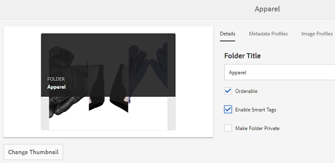

# Preparar [!DNL Assets] para marcação inteligente {#configure-asset-tagging-using-the-smart-content-service}

Antes de começar a marcar seus ativos usando os Serviços de Conteúdo Inteligente, integre o [!DNL Experience Manager Assets] ao Adobe Developer Console para usar o serviço inteligente do [!DNL Adobe Sensei]. Depois de configurado, treine o serviço usando algumas imagens e uma tag.
Antes de usar o Serviço de conteúdo inteligente, verifique o seguinte:

* [Integrar ao Adobe Developer Console](#integrate-adobe-io).
* [Treine o Serviço de Conteúdo Inteligente](#training-the-smart-content-service).
* Instale o [[!DNL Experience Manager] Service Pack](https://experienceleague.adobe.com/docs/experience-manager-release-information/aem-release-updates/aem-releases-updates.html?lang=pt-BR) mais recente.

>[!IMPORTANT]
>
>Consulte [preparar o Assets para marcação inteligente](https://experienceleague.adobe.com/pt-br/docs/experience-manager-65/content/assets/administer/config-smart-tagging) para obter a configuração de tags inteligentes no AEM 6.5.

**Novos usuários**

Os Serviços de Conteúdo Inteligente não estão mais disponíveis para novos [!DNL Experience Manager Assets] usuários locais.

**Usuários existentes**

Os usuários locais existentes que já têm esse recurso ativado podem continuar usando os Serviços de conteúdo inteligente.

## Integrar ao Adobe Developer Console {#integrate-adobe-io}

Quando você integra com o Adobe Developer Console, o servidor do [!DNL Experience Manager] autentica suas credenciais de serviço no gateway do Adobe Developer Console antes de encaminhar sua solicitação ao Serviço de Conteúdo Inteligente. Para integrar o, é necessário ter uma conta do Adobe ID com privilégios de administrador para a organização e uma licença do Serviço de conteúdo inteligente adquirida e ativada para a organização.

Para configurar o Serviço de conteúdo inteligente, siga estas etapas de nível superior:

1. Crie uma integração no [Adobe Developer Console](#create-adobe-io-integration).

1. Crie a [configuração de conta técnica IMS](#create-ims-account-config) usando a chave de API e outras credenciais da Adobe Developer Console.

1. [Configurar o Serviço de Conteúdo Inteligente](#configure-smart-content-service).

1. [Teste a configuração](#validate-the-configuration).

### Criar integração do Adobe Developer Console {#create-adobe-io-integration}

Para usar APIs do Serviço de Conteúdo Inteligente, crie uma integração no Adobe Developer Console para obter a [!UICONTROL Chave de API] (gerada no campo [!UICONTROL ID do CLIENTE] da integração com o Adobe Developer Console), a [!UICONTROL ID da ORGANIZAÇÃO] e o [!UICONTROL SEGREDO DO CLIENTE] para as [!UICONTROL Configurações do Serviço de Marcação Inteligente do Assets] da configuração de nuvem em [!DNL Experience Manager].

1. Acesse [https://developer.adobe.com](https://developer.adobe.com/) em um navegador. Selecione a conta apropriada e verifique se a organização associada tem a função de **administrador** do sistema.

1. Crie um projeto com o nome que quiser. Clique em **[!UICONTROL Adicionar API]**.

1. Na página **[!UICONTROL Adicionar uma API]**, selecione **[!UICONTROL Experience Cloud]** e escolha **[!UICONTROL Conteúdo inteligente]**. Clique em **[!UICONTROL Avançar]**.

1. Selecione **[!UICONTROL Servidor a servidor OAuth]**. Clique em **[!UICONTROL Avançar]**.
Para obter detalhes sobre como fazer essa configuração, consulte a documentação do Developer Console, dependendo das suas necessidades:

   * Visão geral:
      * [Autenticação de Servidor para Servidor](https://developer.adobe.com/developer-console/docs/guides/authentication/ServerToServerAuthentication/)

   * Criação de uma nova credencial OAuth:
      * [Guia de implementação de credenciais de servidor para servidor do OAuth](https://developer.adobe.com/developer-console/docs/guides/authentication/ServerToServerAuthentication/implementation/)

   * Migrar uma credencial JWT existente para uma credencial OAuth:
      * [Migrando da credencial de conta de serviço (JWT) para a credencial de servidor para servidor OAuth](https://developer.adobe.com/developer-console/docs/guides/authentication/ServerToServerAuthentication/migration/)

1. Na página **[!UICONTROL Selecionar perfis de produtos]**, selecione **[!UICONTROL Serviços de Conteúdo Inteligente]**. Clique em **[!UICONTROL Salvar API configurada]**.

   Uma página exibe mais informações sobre a configuração. Mantenha esta página aberta para copiar e adicionar esses valores nas [!UICONTROL Configurações do Serviço de Marcação Inteligente da Assets] da configuração de nuvem no [!DNL Experience Manager] para configurar marcas inteligentes.

   

### Criar configuração de conta técnica IMS {#create-ims-account-config}

É necessário criar a configuração de conta técnica IMS usando as etapas abaixo:

1. Na interface do [!DNL Experience Manager], acesse **[!UICONTROL Ferramentas]** > **[!UICONTROL Segurança]** > **[!UICONTROL Configurações do Adobe IMS]**.

1. Clique em **[!UICONTROL Criar]**.

1. Na caixa de diálogo Configuração de conta técnica IMS, use os seguintes valores:

   

   | Texto | Descrição |
   | -------- | ---------------------------- |
   | Solução em nuvem | Escolha **[!UICONTROL Tags inteligentes]** no menu suspenso. |
   | Título | Adicione o título da conta IMS de configuração. |
   | Servidor de autorização | Adicionar `https://ims-na1.adobelogin.com` |
   | ID do cliente | A ser fornecido por meio do [console do Adobe Developer](https://developer.adobe.com/console/). |
   | Senha do cliente | A ser fornecido por meio do [console do Adobe Developer](https://developer.adobe.com/console/). |
   | Escopo | A ser fornecido por meio do [console do Adobe Developer](https://developer.adobe.com/console/). |
   | ID da organização | A ser fornecido por meio do [console do Adobe Developer](https://developer.adobe.com/console/). |

1. Selecione a configuração criada e clique em **[!UICONTROL Verificar integridade]**.

1. Confirme a caixa de diálogo de verificação de integridade e clique em fechar assim que a configuração estiver no estado íntegro.

### Criar uma nova configuração {#configure-smart-content-service}

Para configurar a integração, use os valores dos campos [!UICONTROL ID DA CONTA TÉCNICA], [!UICONTROL ID DA ORGANIZAÇÃO], [!UICONTROL SEGREDO DO CLIENTE] e [!UICONTROL ID DO CLIENTE] da integração com o Adobe Developer Console. Criar uma configuração de nuvem de Tags Inteligentes permite a autenticação de solicitações de API da implantação [!DNL Experience Manager].

1. Em [!DNL Experience Manager], navegue até **[!UICONTROL Ferramentas]** > **[!UICONTROL Cloud Service]** > **[!UICONTROL Marca Inteligente]** para abrir as [!UICONTROL Configurações de Marca Inteligente].

1. Clique em **[!UICONTROL Criar]** para criar uma nova configuração. Caso contrário, clique em **[!UICONTROL Propriedades]** para atualizar a configuração existente.

1. Preencha os seguintes campos:

   

   | Texto | Descrição |
   | -------- | ---------------------------- |
   | Título | Adicione o título da conta IMS de configuração. |
   | Configuração IMS da Adobe associada | Escolha a configuração na lista suspensa. |
   | URL do serviço | `https://smartcontent.adobe.io/<region where your Experience Manager author instance is hosted>`. Por exemplo, `https://smartcontent.adobe.io/apac`. Você pode especificar `na`, `emea` ou `apac` como as regiões em que sua instância de autor do Experience Manager está hospedada. |

   >[!NOTE]
   >
   >Se o Experience Manager Managed Service for provisionado antes de 1º de setembro de 2022, use o seguinte URL de serviço:
   >`https://mc.adobe.io/marketingcloud/smartcontent`

1. Clique em **[!UICONTROL Salvar e fechar]**.

### Validar a configuração {#validate-the-configuration}

Após concluir a configuração, você pode usar um MBean JMX para validar a configuração. Para validar, siga estas etapas.

1. Acesse seu servidor [!DNL Experience Manager] em `https://[aem_server]:[port]`.

1. Acesse **[!UICONTROL Ferramentas]** > **[!UICONTROL Operações]** > **[!UICONTROL Console da Web]** para abrir o console OSGi. Clique em **[!UICONTROL Principal] > [!UICONTROL JMX]**.

<!--
1. Click `com.day.cq.dam.similaritysearch.internal.impl`. It opens **[!UICONTROL SimilaritySearch Miscellaneous Tasks]**.-->

1. Clique em `com.day.cq.dam.similaritysearch.internal.impl (SCS)`.

   

1. Clique em `validateConfigs()`. Na caixa de diálogo **[!UICONTROL Validar Configurações]**, clique em **[!UICONTROL Chamar]**.

Os resultados da validação são exibidos no mesmo diálogo.

### Habilitar marcação inteligente no fluxo de trabalho [!UICONTROL Ativo de atualização do DAM] (opcional) {#enable-smart-tagging-in-the-update-asset-workflow-optional}

1. Em [!DNL Experience Manager], vá para **[!UICONTROL Ferramentas]** > **[!UICONTROL Fluxo de Trabalho]** > **[!UICONTROL Modelos]**.

1. Na página **[!UICONTROL Modelos de fluxo de trabalho]**, selecione o modelo de fluxo de trabalho **[!UICONTROL Ativo de atualização DAM]**.

1. Clique em **[!UICONTROL Editar]** na barra de ferramentas.

1. Expanda o painel lateral para exibir as etapas. Arraste a etapa **[!UICONTROL Ativo de tag inteligente]** disponível na seção Fluxo de trabalho do DAM e coloque-a após a etapa **[!UICONTROL Processar miniaturas]**.

   

1. Abra as propriedades da etapa para modificar os detalhes. Em **[!UICONTROL Configurações avançadas]**, verifique se a opção **[!UICONTROL Avanço do manipulador]** está selecionada.

   

1. Na guia **[!UICONTROL Argumentos]**, selecione **[!UICONTROL Ignorar erros]** se desejar que o fluxo de trabalho seja concluído mesmo se a etapa de marcação automática falhar.

   Além disso, para marcar os ativos quando eles forem carregados independentemente de a marcação inteligente estar ativada nas pastas, selecione **[!UICONTROL Ignorar sinalizador de tag inteligente]**.

   

1. Clique no  para fechar a etapa do processo.

1. Clique em **[!UICONTROL Sincronizar]** para salvar o fluxo de trabalho.

## Treinar o serviço de conteúdo inteligente {#training-the-smart-content-service}

Para que o Serviço de conteúdo inteligente reconheça sua taxonomia comercial, execute-a em um conjunto de ativos que já incluem tags relevantes para sua empresa. Para marcar com eficiência as imagens da sua marca, o Serviço de conteúdo inteligente exige que as imagens de treinamento estejam em conformidade com determinadas diretrizes. Após o treinamento, o serviço pode aplicar a mesma taxonomia a um conjunto semelhante de ativos.

Você pode treinar o serviço várias vezes para melhorar sua capacidade de aplicar tags relevantes. Após cada ciclo de treinamento, execute um fluxo de trabalho de marcação e verifique se os ativos estão marcados corretamente.

Você pode treinar o Serviço de conteúdo inteligente periodicamente ou conforme necessário.

>[!NOTE]
>
>O fluxo de trabalho de treinamento é executado somente em pastas.

### Diretrizes para treinamento {#guidelines-for-training}

Para obter melhores resultados, as imagens no seu conjunto de treinamento estão em conformidade com as seguintes diretrizes:

**Quantidade e tamanho:** mínimo de 30 imagens por tag. Mínimo de 500 pixels no lado maior.

**Coerência**: imagens usadas para uma marca específica são visualmente semelhantes.

Por exemplo, não é uma boa ideia marcar todas essas imagens como `my-party` (para treinamento) porque elas não são visualmente semelhantes.

**Cobertura**: use variedade suficiente nas imagens do treinamento. A ideia é fornecer alguns exemplos, mas razoavelmente diversos, para que o Experience Manager aprenda a se concentrar nas coisas certas. Se você estiver aplicando a mesma tag em imagens visualmente diferentes, inclua pelo menos cinco exemplos de cada tipo.

Por exemplo, para a tag *model-down-pose*, inclua mais imagens de treinamento semelhantes à imagem destacada abaixo para que o serviço identifique imagens semelhantes com mais precisão durante a marcação.

**Distração/obstrução**: o serviço treina melhor imagens que têm menos distração (planos de fundo proeminentes, acompanhamentos não relacionados, como objetos/pessoas com o assunto principal).

Por exemplo, para a tag *casual-shoes*, a segunda imagem não é um bom candidato para treinamento.

**Integridade:** se uma imagem se qualificar para mais de uma tag, adicione todas as tags aplicáveis antes de incluir a imagem para treinamento. Por exemplo, para tags, como `raincoat` e `model-side-view`, adicione ambas as tags ao ativo elegível antes de incluí-lo para treinamento.

>[!NOTE]
>
>A capacidade do Serviço de conteúdo inteligente de treinar em suas tags e aplicá-las em outras imagens depende da qualidade de imagens usadas para treinamento. Para obter melhores resultados, a Adobe recomenda usar imagens visualmente semelhantes para treinar o serviço para cada tag.

### Formação periódica {#periodic-training}

Você pode ativar o Serviço de conteúdo inteligente para treinar periodicamente nos ativos e nas tags associadas em uma pasta. Abra a página [!UICONTROL Propriedades] da pasta de ativos, selecione **[!UICONTROL Habilitar Tags Inteligentes]** na guia **[!UICONTROL Detalhes]** e salve as alterações.

Depois que essa opção é selecionada para uma pasta, o [!DNL Experience Manager] executa automaticamente um fluxo de trabalho de treinamento para treinar o Serviço de Conteúdo Inteligente nos ativos da pasta e suas marcas. Por padrão, o fluxo de trabalho de treinamento é executado semanalmente às 12h30 aos sábados.

### Treinamento sob demanda {#on-demand-training}

Você pode treinar o Serviço de conteúdo inteligente sempre que necessário no console Fluxo de trabalho.

1. Na interface do [!DNL Experience Manager], vá para **[!UICONTROL Ferramentas]** > **[!UICONTROL Fluxo de Trabalho]** > **[!UICONTROL Modelos]**.
1. Na página **[!UICONTROL Modelos de Fluxo de Trabalho]**, selecione o fluxo de trabalho **[!UICONTROL Treinamento de Tags Inteligentes]** e clique em **[!UICONTROL Iniciar Fluxo de Trabalho]** na barra de ferramentas.
1. Na caixa de diálogo **[!UICONTROL Executar Fluxo de Trabalho]**, navegue até a pasta de carga que inclui os ativos marcados para treinar o serviço.
1. Especifique um título para o fluxo de trabalho e adicione um comentário. Em seguida, clique em **[!UICONTROL Executar]**. Os ativos e as tags são enviados para treinamento.

   

>[!NOTE]
>
>Quando os ativos em uma pasta forem processados para treinamento, somente os ativos modificados serão processados nos ciclos de treinamento subsequentes.

### Exibir relatórios de treinamento {#viewing-training-reports}

Para verificar se o Serviço de conteúdo inteligente é treinado em suas tags no conjunto de ativos de treinamento, revise o relatório de fluxo de trabalho de treinamento no console Relatórios.

1. Na interface do [!DNL Experience Manager], vá para **[!UICONTROL Ferramentas]** > **[!UICONTROL Assets]** > **[!UICONTROL Relatórios]**.
1. Na página **[!UICONTROL Relatórios de ativos]**, clique em **[!UICONTROL Criar]**.
1. Selecione o relatório **[!UICONTROL Treinamento de Tags Inteligentes]** e clique em **[!UICONTROL Avançar]** na barra de ferramentas.
1. Especifique um título e uma descrição para o relatório. Em **[!UICONTROL Agendar relatório]**, deixe a opção **[!UICONTROL Agora]** selecionada. Se desejar agendar o relatório para posteriormente, selecione **[!UICONTROL Posteriormente]** e especifique uma data e hora. Em seguida, clique em **[!UICONTROL Criar]** na barra de ferramentas.
1. Na página **[!UICONTROL Relatórios de ativos]**, selecione o relatório gerado. Para exibir o relatório, clique em **[!UICONTROL Exibir]** na barra de ferramentas.
1. Revise os detalhes do relatório.

   O relatório exibe o status do treinamento das tags que você treinou. A cor verde na coluna **[!UICONTROL Status de treinamento]** indica que o Serviço de conteúdo inteligente foi treinado para a tag. A cor amarela indica que o serviço não é completamente treinado para uma tag específica. Nesse caso, adicione mais imagens com a tag específica e execute o fluxo de trabalho de treinamento para treinar o serviço completamente na tag.

   Se você não vir suas tags neste relatório, execute o fluxo de trabalho de treinamento novamente para essas tags.

1. Para baixar o relatório, selecione-o na lista e clique em **[!UICONTROL Baixar]** na barra de ferramentas. O relatório é baixado como uma planilha do Microsoft Excel.

## Limitações {#limitations}

* As tags inteligentes aprimoradas se baseiam em modelos de aprendizagem de imagens e suas tags. Esses modelos nem sempre são perfeitos para identificar tags. A versão atual do Serviço de conteúdo inteligente tem as seguintes limitações:

   * Incapacidade de reconhecer diferenças sutis nas imagens. Por exemplo, camisetas finas versus camisetas convencionais.
   * Incapacidade de identificar tags com base em pequenos padrões/partes de uma imagem. Por exemplo, logotipos em camisetas.
   * Há suporte para marcação nas localidades nas quais [!DNL Experience Manager] tem suporte.

* Para pesquisar ativos com marcas inteligentes (comuns ou aprimoradas), use o [!DNL Assets] Omnisearch (pesquisa de texto completo). Não há predicado de pesquisa separado para tags inteligentes.

>[!MORELIKETHIS]
>
>* [Visão geral e como treinar Tags Inteligentes](enhanced-smart-tags.md)
>* [Solução de problemas de marcas inteligentes para credenciais do OAuth](config-oauth.md)
>* [Tutorial em vídeo sobre marcas inteligentes](https://experienceleague.adobe.com/docs/experience-manager-learn/assets/metadata/image-smart-tags.html)
