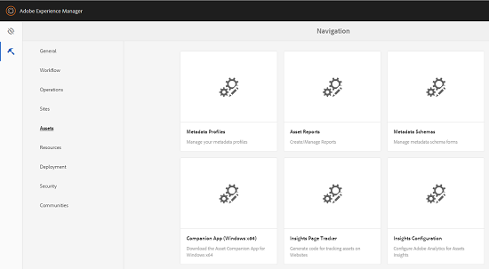

# Configurar o Assets Insights {#configure-asset-insights}

[!DNL Adobe Experience Manager Assets] busca dados de uso sobre ativos digitais usados por sites de terceiros de [!DNL Adobe Analytics]. Para permitir que o Assets Insights recupere esses dados e gere insights, primeiro configure o recurso para integrar com o [!DNL Adobe Analytics]. Para usar este recurso em uma instalação local, compre a licença do [!DNL Adobe Analytics] separadamente. Os clientes no [!DNL Managed Services] recebem a licença [!DNL Analytics] agrupada com o [!DNL Experience Manager]. Consulte [descrição do produto Managed Services](https://helpx.adobe.com/br/legal/product-descriptions/adobe-experience-manager-managed-services.html).

>[!NOTE]
>
>Os insights só são aceitos e fornecidos para imagens.

1. Em [!DNL Experience Manager], clique em **[!UICONTROL Ferramentas]** > **[!UICONTROL Assets]**.

   

1. Clique no cartão **[!UICONTROL Configuração do Insights]**.
1. No assistente, selecione um data center e forneça suas credenciais, incluindo o nome da organização, o nome de usuário e o Segredo compartilhado.

   

   *Figura: Configurar o [!DNL Adobe Analytics] para o Assets Insights no [!DNL Experience Manager].*

1. Clique em **[!UICONTROL Autenticar]**.
1. Depois que o [!DNL Experience Manager] autenticar suas credenciais, na lista **[!UICONTROL Conjunto de Relatórios]**, escolha um conjunto de relatórios [!DNL Adobe Analytics] de onde deseja que o Assets Insights busque dados. Clique em **[!UICONTROL Adicionar]**.
1. Depois que [!DNL Experience Manager] configurar seu conjunto de relatórios, clique em **[!UICONTROL Concluído]**.

## Rastreador de páginas {#page-tracker}

Após configurar sua conta do [!DNL Adobe Analytics], o código do Rastreador de páginas é gerado para você. Para permitir que o Assets Insights rastreie [!DNL Experience Manager] ativos usados em sites de terceiros, inclua o código do rastreador de página no código do site. Use o utilitário [!UICONTROL Rastreador de Páginas] em [!DNL Experience Manager Assets] para gerar o código do rastreador de páginas. Para obter mais informações sobre como incluir o código do Rastreador de páginas em páginas da Web de terceiros, consulte [Usar o rastreador de páginas e incorporar o código nas páginas da Web](/help/assets/use-page-tracker.md).

1. Em [!DNL Experience Manager], clique em **[!UICONTROL Ferramentas]** > **[!UICONTROL Assets]**.

   

1. Na página **[!UICONTROL Navegação]**, clique no cartão do **[!UICONTROL Rastreador de páginas do Insights]**.
1. Clique em **[!UICONTROL Baixar]** para baixar o código do rastreador de página.
