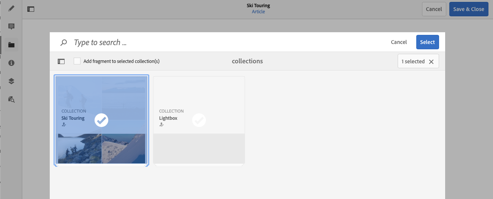

# Conteúdo associado{#associated-content}

O recurso de conteúdo associado do AEM fornece a conexão para que os ativos possam (opcionalmente) ser usados com o fragmento quando ele for adicionado a uma página de conteúdo. Isso proporciona flexibilidade para a entrega de conteúdo headless [fornecendo um intervalo de ativos para acessar ao usar o fragmento de conteúdo em uma página](/help/sites-authoring/content-fragments.md#using-associated-content), além de ajudar a reduzir o tempo necessário para pesquisar o ativo apropriado. Qualquer conteúdo associado pode ser configurado usando o editor de Fragmento de conteúdo.

## Adicionar conteúdo associado {#adding-associated-content}

>[!NOTE]
>
>Existem vários métodos de adicionar [ativos visuais (por exemplo, imagens)](/help/assets/content-fragments/content-fragments.md#fragments-with-visual-assets) ao fragmento e/ou página.

Para fazer a associação, primeiro você precisa [adicionar seus ativos de mídia a uma coleção](/help/assets/manage-collections.md). Depois disso, você pode:

1. Abrir o fragmento e selecionar **Conteúdo associado** no painel lateral.

   

1. Dependendo de alguma coleção já ter sido associada ou não, selecione:

   * **Associar conteúdo** — esta será a primeira coleção associada
   * **Associar Coleção** - coleções associadas que já estão configuradas

1. Selecione a coleção necessária.

   Opcionalmente, é possível adicionar o próprio fragmento à coleção selecionada; isso auxilia no rastreamento.

   

1. Confirmar (com **Selecionar**). A coleção será listada como associada.

   

## Editar conteúdo associado {#editing-associated-content}

Depois de associar uma coleção, você pode:

* **Remover** a associação.
* **Adicionar ativos** à coleção.
* Selecionar um ativo para realizar mais ações.
* Editar o ativo.
