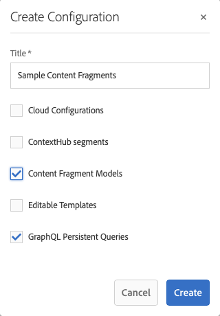
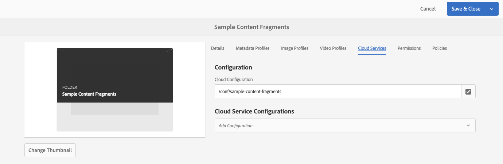

# Fragmentos de conteúdo - Navegador de configuração{#content-fragments-configuration-browser}

Saiba como ativar determinadas funcionalidades do fragmento de conteúdo no Navegador de configuração para usar os recursos avançados de entrega headless do Adobe Experience Manager (AEM).

## Habilitar a funcionalidade de fragmento de conteúdo para sua instância {#enable-content-fragment-functionality-instance}

Antes de usar fragmentos de conteúdo, use o **Navegador de configuração** para habilitar o seguinte:

* **Modelos de fragmentos de conteúdo** (obrigatório)
* **Consultas persistentes de GraphQL** (opcional)

>[!CAUTION]
>
>Se você não habilitar os **modelos de fragmentos de conteúdo**:
>
>* a opção **Criar** não estará disponível para criar modelos.
>* você não pode [selecionar a configuração de sites para criar o ponto de extremidade relacionado](/help/sites-developing/headless/graphql-api/graphql-endpoint.md#enabling-graphql-endpoint).

Para habilitar a funcionalidade dos fragmentos de conteúdo, você deve fazer o seguinte:

* Ativar o uso da funcionalidade de fragmento de conteúdo por meio do navegador de configuração
* Aplicar a configuração à sua pasta de ativos

### Habilitar a funcionalidade de fragmento de conteúdo no navegador de configuração {#enable-content-fragment-functionality-in-configuration-browser}

Para [usar determinadas funcionalidades do Fragmento de Conteúdo](#creating-a-content-fragment-model), você **deve** habilitá-las primeiro por meio do **Navegador de Configuração**:

>[!NOTE]
>
>Para obter mais informações, consulte [Navegador de Configuração:](/help/sites-administering/configurations.md#using-configuration-browser).

1. Navegue até **Ferramentas**, **Geral**, e abra o **Navegador de configuração**.

1. Selecione **Criar** para abrir a caixa de diálogo, onde você:

   1. Especifica um **Título**.
   1. Para permitir seu uso, selecione
      * **Modelos de fragmentos de conteúdo**
      * **Consultas persistentes de GraphQL**

      

1. Selecione **Criar** para salvar a definição.

<!-- 1. Select the location appropriate to your website. -->

### Aplique a configuração à sua pasta de ativos {#apply-the-configuration-to-your-assets-folder}

Quando a configuração **global** está habilitada para a funcionalidade de fragmento de conteúdo, ela se aplica a qualquer pasta do Assets.

Para usar outras configurações (ou seja, excluindo globais) com uma pasta do Assets comparável, é necessário definir a conexão. Isso é feito ao selecionar a **Configuração** apropriada na guia **Serviços da nuvem** das **Propriedades da pasta** da pasta apropriada.

