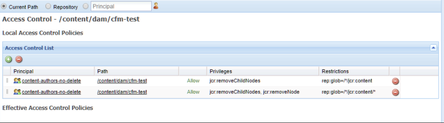

# Fragmentos de conteúdo - Considerações sobre a exclusão {#content-fragments-delete-considerations}

Analise essas considerações importantes antes de definir as políticas de exclusão de fragmentos de conteúdo no AEM. Os fragmentos de conteúdo são uma ferramenta eficiente para fornecer conteúdo headless, e as implicações de excluí-los devem ser cuidadosamente consideradas.

## Permissões — Excluir ou não excluir {#permissions-delete-or-not-delete}

A capacidade de excluir conteúdo é uma ferramenta poderosa, mas também perigosa, com muitos setores precisando restringir e controlar a distribuição desses privilégios.

Com relação às permissões de exclusão, os fragmentos de conteúdo devem ser considerados em dois níveis:

1. **O fragmento de conteúdo como uma única entidade.**

   * **Caso de uso**: um usuário que precisa editar/atualizar um fragmento de conteúdo **e excluir um fragmento inteiro**.
   * **Permissões**: a permissão [Excluir](/help/sites-administering/security.md#actions) pode ser [atribuída por meio do Gerenciamento de Usuários e/ou Grupos](/help/sites-administering/security.md#managing-permissions).

2. **As várias entidades secundárias que compõem um fragmento de conteúdo; por exemplo, variações, nós secundários.**

   A operação básica do editor de fragmentos de conteúdo requer que esses elementos transitórios secundários possam ser excluídos. Por exemplo, ao manipular variações; também ao editar metadados ou gerenciar conteúdo associado.

   * **Caso de uso**: um usuário que precisa editar/atualizar um fragmento de conteúdo, mas **sem ter permissão para excluir um fragmento inteiro**.
   * **Permissões**: consulte [Permissões necessárias somente para funcionalidade de edição](#permissions-required-for-editor-functionality-only).

>[!NOTE]
>
>Quando um usuário não tem permissões de [Exclusão](/help/sites-administering/security.md#actions), o editor de Fragmento de conteúdo opera no modo *somente leitura*.

>[!NOTE]
>
>Consulte também [Como auditar operações de gerenciamento de usuários no AEM](/help/sites-administering/audit-user-management-operations.md).

## Permissões necessárias somente para funcionalidade de edição {#permissions-required-for-editor-functionality-only}

Para usuários que precisam editar/atualizar um fragmento de conteúdo, **sem permitir que excluam um fragmento inteiro**, permissões específicas devem ser atribuídas, já que a operação básica do editor de fragmentos de conteúdo requer que elementos transitórios secundários possam ser excluídos.

Por exemplo, ao manipular variações; também ao editar metadados ou gerenciar conteúdo associado.

>[!NOTE]
>
>As permissões de exclusão, necessárias para editar/atualizar um Fragmento de conteúdo, estão incluídas na permissão de exclusão [atribuída por meio do gerenciamento de usuários e/ou grupos](/help/sites-administering/security.md#managing-permissions).

As permissões necessárias para editar/atualizar um fragmento precisam ser aplicadas ao nó que contém o fragmento de conteúdo ou a um nó principal apropriado (em qualquer nível no `/content/dam`). Quando atribuídas a esse nó principal, as permissões serão aplicadas a todos os nós dentro dessa ramificação.

Por exemplo, uma pasta que manterá todos os fragmentos de conteúdo, como:

* `/content/dam/contentfragments`

>[!CAUTION]
>
>Definir as permissões em `/content/dam` também é possível, pois todos os fragmentos de conteúdo são armazenados aqui.
>
>No entanto, essa ação aplica as mesmas permissões de exclusão a *todos* os outros tipos de ativos também.

Os pré-requisitos de permissões para permitir que um usuário e/ou grupo específico edite/atualize um fragmento de conteúdo são:

>[!NOTE]
>
>Esta lista mostra todos os privilégios necessários, não apenas os privilégios de exclusão.

* Para os nós ou pastas do fragmento de conteúdo:

  * `jcr:addChildNodes`, `jcr:modifyProperties`

* Para o nó `jcr:content` de todos os fragmentos de conteúdo:

  * `jcr:addChildNodes`, `jcr:modifyProperties` e `jcr:removeChildNodes`

* Para todos os nós abaixo de `jcr:content` de todos os fragmentos de conteúdo:

  * `jcr:addChildNodes`, `jcr:modifyProperties` e `jcr:removeChildNodes`, `jcr:removeNode`

Esses privilégios `remove` devem ser [administrados usando Listas de Controle de Acesso, no CRXDE Lite](/help/sites-administering/user-group-ac-admin.md#access-right-management).

Os privilégios `add` e `modify` também podem ser administrados no CRXDE Lite ou usando o console de Gerenciamento de Usuários.

Por exemplo, a definição dos privilégios `remove` para um grupo `content-authors-no-delete`:

