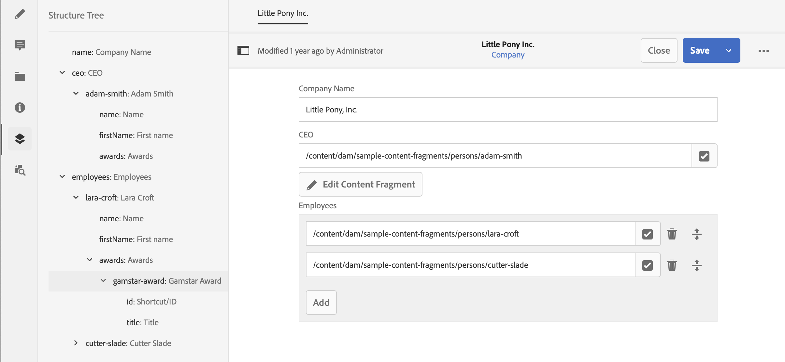

# Árvore de estrutura do fragmento de conteúdo {#content-fragment-structure-tree}

Use o recurso de árvore de estrutura do editor de fragmento de conteúdo no AEM para entender melhor seu conteúdo headless.

No editor de fragmento de conteúdo, é possível selecionar o ícone Árvore de estrutura:

Isso abre uma representação da estrutura do fragmento no painel esquerdo. Com isso, você pode navegar pelos fragmentos referenciados. Selecionar uma referência abre esse fragmento para edição.

>[!NOTE]
>
>Com a utilização da navegação estrutural no painel principal, é possível navegar de volta ao ponto inicial.

