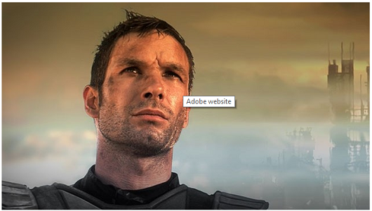

# Adicionar mapas de imagem {#adding-image-maps}

Os mapas de imagem permitem adicionar uma ou mais áreas com hiperlink que funcionam como outros hiperlinks.

1. Siga um destes procedimentos para abrir o **[!UICONTROL Editor de imagens no local]**:

   * Usando as Ações rápidas, clique em **[!UICONTROL Editar]** que aparece em um ativo no modo de exibição **[!UICONTROL Cartão]**. Na exibição em Lista, selecione o ativo e clique na opção **[!UICONTROL Editar]** na barra de ferramentas.

     >[!NOTE]
     >
     >As Ações Rápidas não estão disponíveis na exibição **[!UICONTROL Lista]**.

   * No modo de exibição **[!UICONTROL Cartão]** ou **[!UICONTROL Lista]**, selecione o ativo e clique em **[!UICONTROL Editar]** na barra de ferramentas.
   * Clique em **[!UICONTROL Editar]** na página do ativo.

1. Para inserir um mapa de imagem, clique em **[!UICONTROL Iniciar mapa]**  na barra de ferramentas.
1. Selecione a forma do mapa de imagem. O ponto de acesso da forma selecionada é colocado na imagem.

   

1. Clique no ponto de acesso e insira o URL e o texto Alt. Na lista **[!UICONTROL Target]**, especifique onde deseja que o mapa de imagem seja exibido, por exemplo, a mesma guia, uma nova guia ou um iFrame. Por exemplo, digite `https://www.adobe.com` como a URL, `Adobe website` como o texto Alt e especifique **[!UICONTROL Nova Guia]** da lista **[!UICONTROL Target]** para que o mapa de imagem seja aberto em uma nova guia.

   

1. Clique em **[!UICONTROL Confirmar]** e em **[!UICONTROL Concluir]**  na barra de ferramentas para salvar as alterações.

   Para excluir o mapa de imagem, clique no ponto de acesso e em **[!UICONTROL Excluir]** .

1. Para exibir o mapa de imagem, navegue até a página de detalhes do ativo e passe o cursor sobre a imagem.

   

   Se a opção Dynamic Media estiver habilitada, navegue até o editor de Ativos e clique em **[!UICONTROL Mapa]** para exibir todos os mapas de imagem aplicados.
