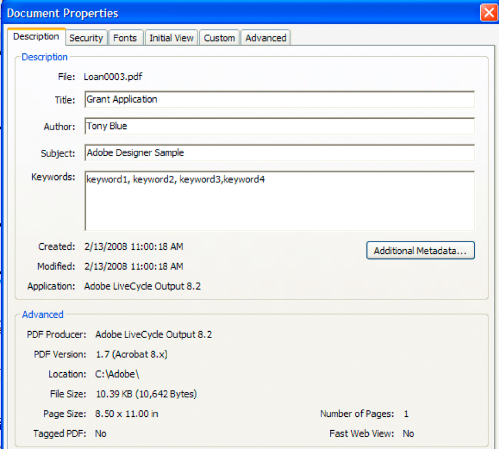

# Trabalhar com utilitários do XMP {#working-with-xmp-utilities}

**Exemplos e exemplos neste documento são somente para AEM Forms no ambiente JEE.**

**Sobre o Serviço de Utilitários da XMP**

Os documentos do PDF contêm metadados, que são informações sobre o documento diferenciadas do conteúdo do documento, como texto e gráficos. A Adobe Extensible Metadata Platform (XMP) é um padrão para manipular metadados de documentos.

O serviço Utilitários da XMP pode recuperar e salvar metadados XMP de documentos do PDF e importar metadados XMP para documentos do PDF.

Você pode realizar essas tarefas usando o serviço Utilitários da XMP:

* Importe metadados para documentos do PDF. (Consulte [Importar metadados para documentos do PDF](xmp-utilities.md#importing-metadata-into-pdf-documents).)
* Exportar metadados de documentos do PDF. (Consulte [Exportar metadados de documentos do PDF](xmp-utilities.md#exporting-metadata-from-pdf-documents).)

>[!NOTE]
>
>Para obter mais informações sobre o serviço Utilitários XMP, consulte [Referência de serviços para o AEM Forms](https://www.adobe.com/go/learn_aemforms_services_63).

## Importação de metadados para documentos do PDF {#importing-metadata-into-pdf-documents}

Você pode usar o Java dos Utilitários da XMP e as APIs de serviço da Web para importar programaticamente os metadados do XMP para um documento do PDF. Os metadados fornecem informações sobre um documento PDF, como o autor do documento e palavras-chave relacionadas ao documento. Os metadados podem ser exibidos na caixa de diálogo Propriedades do documento do documento, conforme mostrado na ilustração a seguir.



Para importar metadados de forma programática para um documento PDF, você pode usar um documento XML existente que especifique os valores de metadados ou usar um objeto do tipo `XMPUtilityMetadata`. (Consulte [Referência da API do AEM Forms](https://www.adobe.com/go/learn_aemforms_javadocs_63_en).)

>[!NOTE]
>
>Esta seção discute como usar um documento XML para importar metadados em um documento do PDF.

O código XML a seguir contém valores de metadados que correspondem à ilustração anterior. Por exemplo, observe os itens em negrito, que especificam palavras-chave.

```xml
 <?xpacket begin="?" id="W5M0MpCehiHzreSzNTczkc9d"?>
 <x:xmpmeta xmlns:x="adobe:ns:meta/" x:xmptk="Adobe XMP Core 4.2-jc015 52.349034, 2008 Jun 20 00:30:39-PDT (debug)">
       <rdf:RDF xmlns:rdf="https://www.w3.org/1999/02/22-rdf-syntax-ns#">
          <rdf:Description rdf:about=""
                xmlns:xmp="https://ns.adobe.com/xap/1.0/">
             <xmp:MetadataDate>2008-10-22T10:52:21-04:00</xmp:MetadataDate>
             <xmp:CreatorTool>AEM Forms</xmp:CreatorTool>
             <xmp:ModifyDate>2008-10-22T10:52:21-04:00</xmp:ModifyDate>
             <xmp:CreateDate>2008-02-13T11:00:18-05:00</xmp:CreateDate>
          </rdf:Description>
          <rdf:Description rdf:about=""
                xmlns:pdf="https://ns.adobe.com/pdf/1.3/">
             <pdf:Producer>AEM Forms</pdf:Producer>
             <pdf:Keywords>keyword1, keyword2, keyword3,keyword4</pdf:Keywords>
          </rdf:Description>
          <rdf:Description rdf:about=""
                xmlns:xmpMM="https://ns.adobe.com/xap/1.0/mm/">
             <xmpMM:DocumentID>uuid:1cce1f84-331e-4d8d-8538-15441c271dd7</xmpMM:DocumentID>
             <xmpMM:InstanceID>uuid:cdda0ca6-7c91-4771-9dc9-796c8fe59350</xmpMM:InstanceID>
          </rdf:Description>
          <rdf:Description rdf:about=""
                >
             <dc:format>application/pdf</dc:format>
             <dc:description>
                <rdf:Alt>
                   <rdf:li xml:lang="x-default">Adobe Designer Sample</rdf:li>
                </rdf:Alt>
             </dc:description>
             <dc:title>
                <rdf:Alt>
                   <rdf:li xml:lang="x-default">Grant Application</rdf:li>
                </rdf:Alt>
             </dc:title>
             <dc:creator>
                <rdf:Seq>
                   <rdf:li>Tony Blue</rdf:li>
                </rdf:Seq>
             </dc:creator>
             <dc:subject>
                <rdf:Bag>
                   <rdf:li>keyword1</rdf:li>
                   <rdf:li>keyword2</rdf:li>
                   <rdf:li>keyword3</rdf:li>
                   <rdf:li>keyword4</rdf:li>
                </rdf:Bag>
             </dc:subject>
          </rdf:Description>
          <rdf:Description rdf:about=""
                xmlns:desc="https://ns.adobe.com/xfa/promoted-desc/">
             <desc:version rdf:parseType="Resource">
                <rdf:value>1.0</rdf:value>
                <desc:ref>/template/subform[1]</desc:ref>
             </desc:version>
             <desc:contact rdf:parseType="Resource">
                <rdf:value>Adobe Systems Incorporated</rdf:value>
                <desc:ref>/template/subform[1]</desc:ref>
             </desc:contact>
          </rdf:Description>
       </rdf:RDF>
 </x:xmpmeta>
```

>[!NOTE]
>
>Para obter mais informações sobre o serviço Utilitários XMP, consulte [Referência de serviços para o AEM Forms](https://www.adobe.com/go/learn_aemforms_services_63).

### Resumo das etapas {#summary-of-steps}

Para importar metadados do XMP para um documento do PDF, execute as seguintes etapas:

1. Incluir arquivos de projeto.
1. Crie um cliente XMPUutilityService.
1. Chame a operação de importação de metadados do XMP.

**Incluir arquivos de projeto**

Inclua os arquivos necessários no projeto de desenvolvimento. Se você estiver criando uma aplicação cliente usando Java, inclua os arquivos JAR necessários. Se você estiver usando serviços da Web, certifique-se de incluir os arquivos proxy.

**Criar um cliente XMPUtilityService**

Antes de executar programaticamente uma operação de Utilitários XMP, você deve criar um cliente XMPUtilityService. Com a API Java, isso é feito criando um objeto `XMPUtilityServiceClient`. Com a API de serviço Web, isso é feito usando um objeto `XMPUtilityServiceService`.

**Invocar a operação de importação de metadados do XMP**

Depois de criar o cliente de serviço, você pode chamar uma das operações de importação de metadados do XMP para importar os metadados do XMP para o documento do PDF especificado.

**Consulte também**

[Importar metadados do XMP usando a API Java](xmp-utilities.md#import-xmp-metadata-using-the-java-api)

[Importação de metadados do XMP usando a API do serviço da Web](xmp-utilities.md#importing-xmp-metadata-using-the-web-service-api)

[Inclusão de arquivos da biblioteca Java do AEM Forms](/help/forms/developing/invoking-aem-forms-using-java.md#including-aem-forms-java-library-files)

[Definindo propriedades de conexão](/help/forms/developing/invoking-aem-forms-using-java.md#setting-connection-properties)

### Importar metadados do XMP usando a API Java {#import-xmp-metadata-using-the-java-api}

Importe metadados do XMP usando a API de utilitários do XMP (Java):

1. Incluir arquivos de projeto

   Inclua arquivos JAR do cliente, como adobe-pdfutility-client.jar, no caminho de classe do projeto Java.

   >[!NOTE]
   >
   >O arquivo adobe-pdfutility-client.jar contém classes que permitem chamar programaticamente o serviço de Utilitários do XMP.

1. Criar um cliente XMPUutilityService

   Crie um objeto `XMPUtilityServiceClient` usando seu construtor e transmitindo um objeto `ServiceClientFactory` que contenha propriedades de conexão.

1. Chame a operação de importação de metadados do XMP

   Para modificar os metadados do XMP, chame o método `importMetadata` do objeto `XMPUtilityServiceClient` ou seu método `importXMP`.

   Se você usar o método `importMetadata`, passe os seguintes valores:

   * Um objeto `com.adobe.idp.Document` que representa o arquivo PDF.
   * Um objeto `XMPUtilityMetadata` que contém os metadados a serem importados.

   Se você usar o método `importXMP`, passe os seguintes valores:

   * Um objeto `com.adobe.idp.Document` que representa o arquivo PDF.
   * Um objeto `com.adobe.idp.Document` que representa um arquivo XML que contém os metadados a serem importados.

   Em ambos os casos, o valor retornado é um objeto `com.adobe.idp.Document` que representa o arquivo PDF com os metadados recém-importados. Em seguida, você pode salvar esse objeto em disco.

**Consulte também**

[Importação de metadados para documentos do PDF](xmp-utilities.md#importing-metadata-into-pdf-documents)

[Inclusão de arquivos da biblioteca Java do AEM Forms](/help/forms/developing/invoking-aem-forms-using-java.md#including-aem-forms-java-library-files)

[Definindo propriedades de conexão](/help/forms/developing/invoking-aem-forms-using-java.md#setting-connection-properties)

### Importação de metadados do XMP usando a API do serviço da Web {#importing-xmp-metadata-using-the-web-service-api}

Para importar programaticamente metadados do XMP usando a API de serviço Web dos Utilitários XMP, execute as seguintes tarefas:

1. Incluir arquivos de projeto

   * Crie um assembly de cliente Microsoft .NET que consuma o arquivo WSDL do serviço de Utilitários XMP. (Consulte [Invocar o AEM Forms usando a codificação Base64](/help/forms/developing/invoking-aem-forms-using-web.md#invoking-aem-forms-using-base64-encoding).)
   * Referencie o assembly do cliente Microsoft .NET. (Consulte [Criando um assembly de cliente .NET que use codificação Base64](/help/forms/developing/invoking-aem-forms-using-web.md#creating-a-net-client-assembly-that-uses-base64-encoding).)

1. Criar um cliente XMPUutilityService

   Crie um objeto `XMPUtilityServiceService` usando seu construtor de classe de proxy.

1. Chame a operação de importação de metadados do XMP

   Para modificar os metadados do XMP, chame o método `importMetadata` do objeto `XMPUtilityServiceService` ou seu método `importXMP`.

   Se você usar o método `importMetadata`, passe os seguintes valores:

   * Um objeto `BLOB` que representa o arquivo PDF.
   * Um objeto `XMPUtilityMetadata` que contém os metadados a serem importados.

   Se você usar o método `importXMP`, passe os seguintes valores:

   * Um objeto `BLOB` que representa o arquivo PDF.
   * Um objeto `BLOB` que representa um arquivo XML que contém os metadados a serem importados.

   Em ambos os casos, o valor retornado é um objeto `BLOB` que representa o arquivo PDF com os metadados recém-importados. Em seguida, você pode salvar esse objeto em disco.

**Consulte também**

[Importação de metadados para documentos do PDF](xmp-utilities.md#importing-metadata-into-pdf-documents)

<!--REVIEW: [Quick Start (Base64): Importing XMP metadata using the web service API](unresolvedlink-lc-qs-xmp-utilities-xu.xml#ws624e3cba99b79e12e69a9941333732bac8-7be8.2)-->

[Chamada de AEM Forms usando codificação Base64](/help/forms/developing/invoking-aem-forms-using-web.md#invoking-aem-forms-using-base64-encoding)

[Criando um assembly de cliente .NET que usa codificação Base64](/help/forms/developing/invoking-aem-forms-using-web.md#creating-a-net-client-assembly-that-uses-base64-encoding)

## Exportar metadados de documentos do PDF {#exporting-metadata-from-pdf-documents}

Você pode usar o Java dos Utilitários da XMP e as APIs de serviço da Web para recuperar e salvar programaticamente os metadados do XMP de um documento do PDF.

>[!NOTE]
>
>Para obter mais informações sobre o serviço Utilitários XMP, consulte [Referência de serviços para o AEM Forms](https://www.adobe.com/go/learn_aemforms_services_63).

### Resumo das etapas {#summary_of_steps-1}

Para exportar metadados do XMP de um documento do PDF, execute as seguintes etapas:

1. Incluir arquivos de projeto.
1. Crie um cliente XMPUutilityService.
1. Chame a operação de exportação de metadados do XMP.

**Incluir arquivos de projeto**

Inclua os arquivos necessários no projeto de desenvolvimento. Se você estiver criando uma aplicação cliente usando Java, inclua os arquivos JAR necessários. Se você estiver usando serviços da Web, certifique-se de incluir os arquivos proxy.

**Criar um cliente XMPUtilityService**

Antes de executar programaticamente uma operação de Utilitários XMP, você deve criar um cliente XMPUtilityService. Com o Java AP, isso é realizado criando um objeto `XMPUtilityServiceClient`. Com a API de serviço Web, isso é feito usando um objeto `XMPUtilityServiceService`.

**Invocar a operação de exportação de metadados do XMP**

Depois de criar o cliente de serviço, você pode chamar uma das operações de exportação de metadados do XMP, que podem ser usadas para inspecionar os metadados do XMP ou salvá-los em disco.

**Consulte também**

[Importar metadados do XMP usando a API Java](xmp-utilities.md#import-xmp-metadata-using-the-java-api)

[Importação de metadados do XMP usando a API do serviço da Web](xmp-utilities.md#importing-xmp-metadata-using-the-web-service-api)

[Inclusão de arquivos da biblioteca Java do AEM Forms](/help/forms/developing/invoking-aem-forms-using-java.md#including-aem-forms-java-library-files)

[Definindo propriedades de conexão](/help/forms/developing/invoking-aem-forms-using-java.md#setting-connection-properties)

### Exportar metadados do XMP usando a API Java {#export-xmp-metadata-using-the-java-api}

Exporte metadados do XMP usando a API de utilitários do XMP (Java):

1. Incluir arquivos de projeto

   Inclua arquivos JAR do cliente, como adobe-pdfutility-client.jar, no caminho de classe do projeto Java.

   >[!NOTE]
   >
   >O arquivo adobe-pdfulity-client.jar contém classes que permitem chamar programaticamente o serviço do Utilitário XMP.

1. Criar um cliente XMPUutilityService

   Crie um objeto `XMPUtilityServiceClient` usando seu construtor e transmitindo um objeto `ServiceClientFactory` que contenha propriedades de conexão.

1. Chame a operação de importação de metadados do XMP

   Para inspecionar os metadados do XMP, chame o método `exportMetadata` do objeto `XMPUtilityServiceClient` e passe um objeto `com.adobe.idp.Document` que represente o arquivo PDF. O método retorna um objeto `XMPUtilityMetadata` que contém os metadados recuperados.

   Para recuperar e salvar os metadados do XMP, chame o método `exportXMP` do objeto `XMPUtilityServiceClient` e passe um objeto `com.adobe.idp.Document` que represente o arquivo PDF. O método retorna um objeto `com.adobe.idp.Document` que contém os metadados recuperados, os quais podem ser salvos em disco como um arquivo XML.

**Consulte também**

[Exportar metadados de documentos do PDF](xmp-utilities.md#exporting-metadata-from-pdf-documents)

[Inclusão de arquivos da biblioteca Java do AEM Forms](/help/forms/developing/invoking-aem-forms-using-java.md#including-aem-forms-java-library-files)

[Definindo propriedades de conexão](/help/forms/developing/invoking-aem-forms-using-java.md#setting-connection-properties)

### Exportar metadados do XMP usando a API do serviço Web {#export-xmp-metadata-using-the-web-service-api}

Exporte metadados do XMP usando a API de utilitários do XMP (serviço da Web):

1. Incluir arquivos de projeto

   * Crie um assembly de cliente Microsoft .NET que consuma o arquivo WSDL do serviço de Utilitários XMP.
   * Referencie o assembly do cliente Microsoft .NET.

1. Criar um cliente XMPUutilityService

   Crie um objeto `XMPUtilityServiceService` usando seu construtor de classe de proxy.

1. Chame a operação de importação de metadados do XMP

   Para inspecionar os metadados do XMP, chame o método `exportMetadata` do objeto `XMPUtilityServiceClient` e passe um objeto `BLOB` que represente o arquivo PDF. O método retorna um objeto `XMPUtilityMetadata` que contém os metadados recuperados.

   Para recuperar e salvar os metadados do XMP, chame o método `exportXMP` do objeto `XMPUtilityServiceClient` e passe um objeto `BLOB` que represente o arquivo PDF. O método retorna um objeto `BLOB` que contém os metadados recuperados, os quais podem ser salvos em disco como um arquivo XML.

**Consulte também**

[Exportar metadados de documentos do PDF](xmp-utilities.md#exporting-metadata-from-pdf-documents)

[Chamada de AEM Forms usando codificação Base64](/help/forms/developing/invoking-aem-forms-using-web.md#invoking-aem-forms-using-base64-encoding)

[Criando um assembly de cliente .NET que usa codificação Base64](/help/forms/developing/invoking-aem-forms-using-web.md#creating-a-net-client-assembly-that-uses-base64-encoding)
