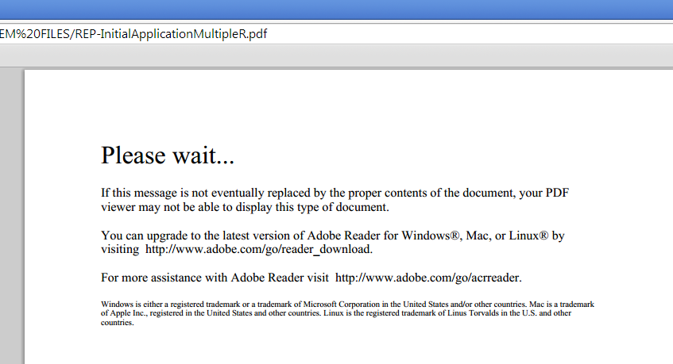

# Alteração do conteúdo da Página zero no Designer {#changing-page-zero-content-in-designer}

O conteúdo da Página Zero é exibido por padrão quando um visualizador que não seja da Adobe PDF, como o visualizador padrão do PDF em [!DNL Chrome] ou [!DNL Firefox], não consegue ler o conteúdo do formulário PDF/XFA. A mensagem padrão de Página zero é mostrada abaixo.

A versão [!DNL AEM Forms] do Designer permite alterar a mensagem que é exibida na Página Zero. Para alterar a mensagem Página zero, execute as seguintes etapas:

1. Verifique se você tem a versão [!DNL AEM Forms] do Designer instalada. Você pode verificar a versão na tela Sobre do designer.

1. Abra o formulário para o qual deseja alterar o conteúdo da Página zero.

1. Clique em **[!UICONTROL Arquivo]** > **[!UICONTROL Propriedades do Formulário]**.

1. Na caixa de diálogo [!UICONTROL Propriedades do Formulário], clique em  (ícone de adição) para adicionar uma propriedade personalizada.

1. Especifique **_pagezerocontent** como o nome da propriedade.
1. Adicione a nova mensagem Página zero, em formato Rich Text, como valor. Por exemplo:

   `<body xmlns="http://www.w3.org/1999/xhtml" xmlns:xfa="http://www.xfa.org/schema/xfa-data/1.0/">
 

You are seeing this message maybe because you are using a non Adobe PDF Viewer or an Old version of Adobe Reader. You can upgrade to the latest version of Adobe Reader for Windows, Mac, or Linux by visiting  https://www.adobe.com/go/reader_download_br.

 

For more assistance with Adobe Reader visit  https://www.adobe.com/go/acrreader_br.
</body>`

1. Salve o formulário como PDF.

1. Exiba o formulário do PDF no navegador para confirmar que a mensagem foi atualizada. O exemplo de valor acima aparece da seguinte maneira:

   

>[!NOTE]
>
>A propriedade personalizada criada pode não aparecer corretamente na caixa de diálogo Propriedades do formulário quando você reabrir o formulário. No entanto, funciona bem e o formulário exibe a mensagem Página zero atualizada.
