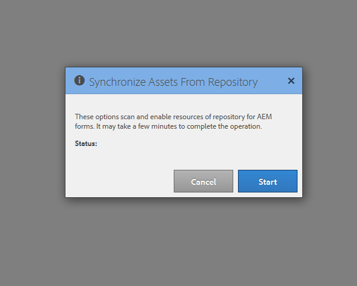
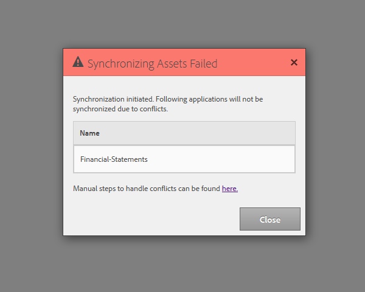

# Configuração do scheduler de sincronização {#configuring-the-synchronization-scheduler}

Por padrão, o agendador de sincronização é executado a cada 3 minutos para sincronizar todos os ativos modificados e atualizados no repositório por meio do LiveCycle Workbench 11. Os aplicativos que contêm formulários e recursos ficam visíveis na interface do usuário do AEM Forms após a conclusão do processo de sincronização.

## Alterar intervalo do agendador de sincronização {#change-interval-of-the-synchronization-scheduler}

Execute as seguintes etapas para alterar o intervalo do scheduler de sincronização:

1. Faça logon no AEM Configuration Manager. A URL do Configuration Manager é `https://'[server]:[port]'/lc/system/console/configMgr`

1. Localize e abra o pacote **FormsManagerConfiguration**.

1. Especifique um novo valor para a opção **Frequência do Agendador de Sincronização**.

   A unidade da frequência é minutos. Por exemplo, para configurar o scheduler para ser executado a cada 60 minutos, especifique 60.

## Sincronização de ativos {#synchronizing-assets}

Você pode usar a opção **Sincronizar Assets do Repositório** para sincronizar manualmente os ativos. Execute as seguintes etapas para sincronizar manualmente os ativos:

1. Faça logon no AEM Forms. A URL padrão é `https://'[server]:[port]'/lc/aem/forms/`.

   

   **Figura:** *Interface do usuário do AEM Forms*

1. Clique no ícone  na barra de ferramentas. Se você não tiver nenhum ativo no último caminho configurado, abra a caixa de diálogo como mostrado abaixo. Clique em **Iniciar** para iniciar a sincronização.

   

   **Figura:** *Caixa de diálogo de sincronização*

## Solução de problemas de erro de sincronização {#troubleshooting-synchronization-error}

Você pode criar novos aplicativos no designer de workflow (LiveCycle Workbench).

Se o aplicativo recém-criado e uma pasta em /content/dam/formsanddocuments tiverem nomes idênticos, um erro &quot;*Um ativo com o mesmo nome deste aplicativo já existe no nível raiz.*&quot; está registrado.

Para resolver o conflito, renomeie o aplicativo e sincronize manualmente os ativos.

**Figura:** *Conflitos na caixa de diálogo de sincronização de ativos*
