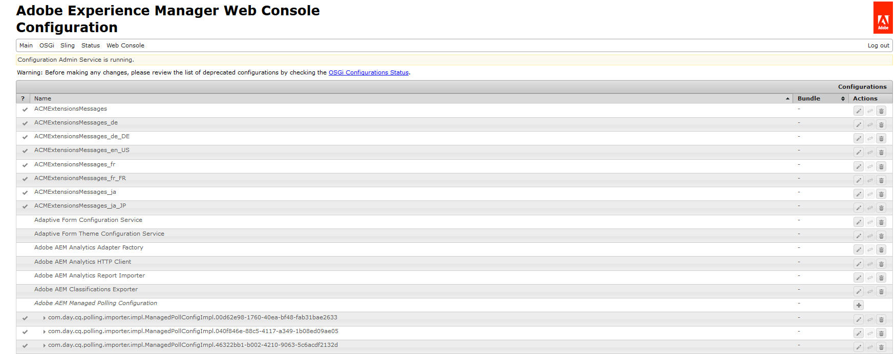
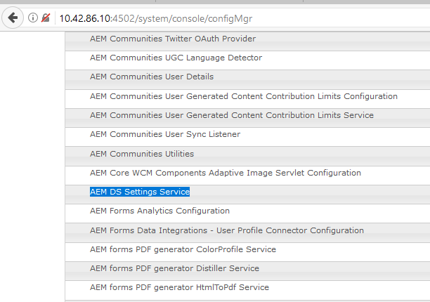
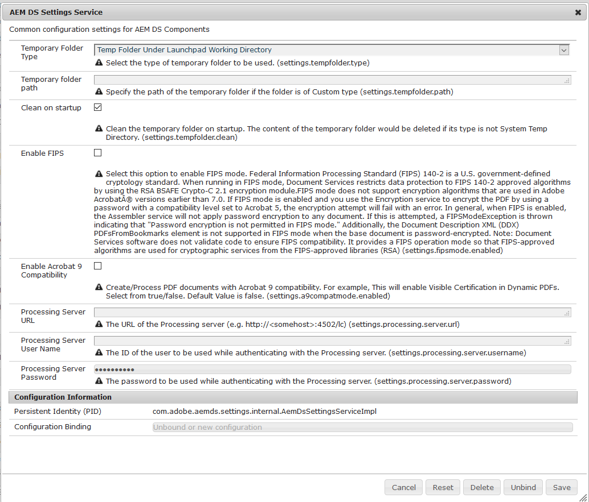

# Definição das configurações do AEM DS{#configuring-aem-ds-settings}

Este artigo descreve como configurar o **Serviço de Configurações do AEM DS**. Essa configuração pode ser usada em vários cenários, por exemplo:

* No Gerenciamento de correspondência

  * Para configurar o fluxo de trabalho AEM Forms
  * Ao usar o Portal do Forms para salvar remotamente rascunhos/envios

* Em Formulários adaptáveis, para casos em que um Formulário adaptável é enviado da instância de publicação

Veja a seguir as etapas para configurar as **[!UICONTROL Configurações do AEM DS]**:

1. Abra o Configuration Manager na instância de publicação usando o URL:\
   *https://localhost:port/system/console/configMgr*.

   

1. Na janela **[!UICONTROL Configuração do Adobe Experience Manager Web Console]**, localize e clique na opção **[!UICONTROL Configurações do AEM DS]**.

   

1. A janela **[!UICONTROL Serviço de Configurações do AEM DS]** exibe as definições de configuração comuns para os Componentes do AEM DS.

   

1. Adicione as seguintes informações nos respectivos campos:

   **[!UICONTROL URL do Servidor de Processamento]**: o Servidor de Processamento é o servidor no qual o fluxo de trabalho do Forms ou do AEM deve ser acionado. Pode ser a mesma URL da instância do autor do AEM ou a outra URL do Servidor (ou seja, https://localhost:port/).

   **[!UICONTROL Nome de Usuário do Servidor de Processamento]**: Nome de Usuário do Fluxo de Trabalho [baseado na URL do servidor sendo usada]

   **[!UICONTROL Processando a senha do servidor]**: senha do usuário do fluxo de trabalho

   >[!NOTE]
   >
   >
   >    
   >    
   >    * Ao usar workflows do Forms ou do AEM, antes de fazer qualquer envio a partir do servidor de publicação, é necessário definir o serviço de configurações do DS. Caso contrário, o envio do Formulário não terá êxito.
   >    
   >
