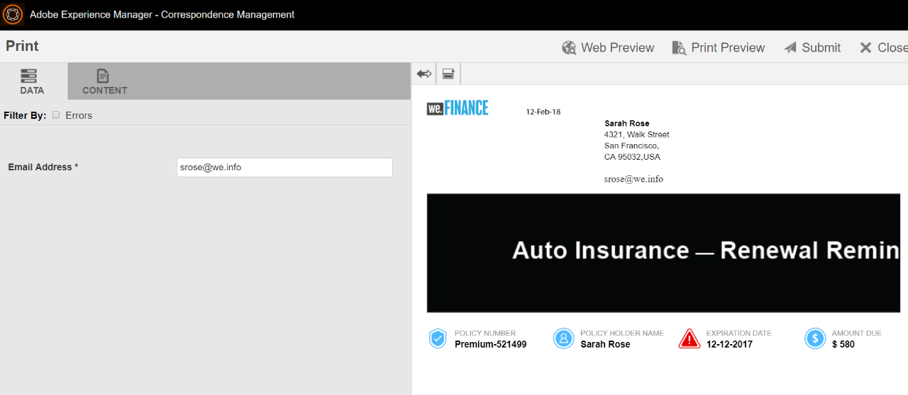
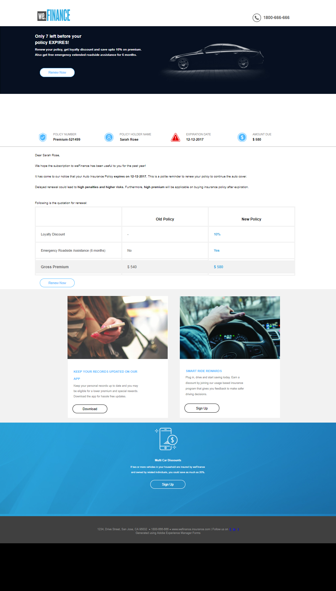

# Apresentação do site de referência da Renovação do Seguro Automático `We.Finance`{#we-finance-auto-insurance-renewal-reference-site-walkthrough}

## Cenário do site de referência `We.Finance`  {#we-finance-reference-site-scenario}

O site do `We.Finance` é um site de serviços financeiros criado para ajudá-lo a conhecer os recursos de comunicações interativas do AEM Forms.

Leia uma apresentação detalhada de um caso de uso de Seguro Automático do `We.Finance` que mostra como os formulários da AEM e sua integração com o Microsoft® Dynamics ajudam a personalizar a experiência do cliente em uma empresa de serviços financeiros. A apresentação interativa foi projetada para facilitar a implementação de transações digitais complexas e a comunicação com o cliente em uma empresa financeira.

**A jornada começa com o caso de uso:**

Sarah Rose é cliente `We.Finance` e adquiriu uma apólice de Seguro Automático. É aquela época do ano para Sarah renovar sua apólice de seguro. Gloria Rios é sua agente de seguros. O site `We.Finance` envia um lembrete para Sarah sobre a renovação da política. Sarah segue as instruções no e-mail e conclui com sucesso o processo.

## Apresentação do aplicativo de Seguro automático {#auto-insurance-application-walkthrough}

O cenário de aplicação do Seguro automático `We.Finance` é uma narração visual para o usuário e se baseia em duas personas:

* Sarah Rose, cliente do `We.Finance`
* Gloria Rios, agente de seguros, `We.Finance`

### Gloria envia uma comunicação de renovação da apólice de seguro de `We.Finance` {#gloria-sends-an-insurance-policy-renewal-communication-from-we-finance}

Gloria faz logon na instância do AEM, clica em **Renovação de Seguro Automático** e clica em **Abrir IU do Agente**. O clique preenche o documento de seguro com detalhes da apólice de Sarah Rose. Gloria clica em **Enviar** e uma mensagem é exibida na tela &quot;Envio iniciado&quot; e depois, em alguns segundos, &quot;Enviado com êxito&quot;.

Sarah recebe um e-mail com o assunto &quot;Sua renovação do seguro automóvel.&quot;

#### Veja você mesmo {#see-it-yourself}

Vá para **Adobe Experience Manager** > **Forms** > **Forms e Documentos** > **`We.Finance`** > **Seguro Automático**. Selecione a **comunicação interativa** de Renovação de Seguro Automático e clique em **Abrir Interface do Usuário do Agente**. A comunicação interativa é aberta na interface do usuário do agente. Insira um endereço de email válido para que eles possam receber o email com o documento de política anexado e clique em Enviar.

Você pode acessar e revisar a comunicação interativa Renovação de Seguro Automático diretamente de `https://[authorHost]: authorPort]/aem/formdetails.html/content/dam/formsanddocuments/we-finance/autoinsurance/auto-insurance-renewal.`

### Sarah recebe uma comunicação de renovação da apólice de seguro de `We.Finance` e decide renovar {#sarah-receives-an-insurance-policy-renewal-communication-from-we-finance-and-decides-to-renew}

Sarah recebe um email com um anexo de `We.Finance`, lembrando a Sarah que sua apólice de Seguro Automático está prestes a expirar. O anexo é a versão impressa da carta do seguro automático da Sarah.

Sarah clica na opção **Renovar Agora** e é direcionada para a versão da Web de sua carta de Seguro Automático. Além desta carta, Sarah encontra a quantidade de tempo restante na política antes que ela expire. A página fornece uma visão geral da apólice de seguro. Ele detalha o Número da apólice, a Quantia Devida, as ofertas de desconto e as recompensas de fidelidade. **Renovar Agora** foi clicado na parte inferior da política.

#### Como funciona {#how-it-works}

A saída da Web e de impressão de sua carta de Seguro Automático é criada usando os recursos de vários canais de comunicações interativas.

O botão Renovar agora no email está vinculado ao aplicativo Renovação de seguro automático, que é uma comunicação interativa em uma instância de publicação.

#### Veja você mesmo {#see-it-yourself-1}

Você deve ter recebido um email com uma PDF anexada. O PDF é uma versão impressa da sua carta de Seguro Automático. Clique em **Renovar Agora** para acessar a versão da política da Web. Verifique suas informações pessoais e os detalhes da política e clique em **Renovar Agora**, que leva você a outra comunicação interativa.

O botão **Renovar agora** no email direciona Sarah para a política na Web. Você pode visitar o seguinte URL:

`https://[authorServer]:[authorPort]/content/document.html?schema=fdm&documentId=/content/forms/af/we-finance/autoinsurance/auto-insurance-renewal/channels/web.html&customerId=1`

Você pode verificar o resumo detalhado de sua Renovação de seguro automático e clicar em **Renovar agora** na parte inferior da página.

### Sarah chega à página de pagamento {#sarah-reaches-the-payment-page}

O site `We.Finance` leva Sarah para a página de Pagamento. Sarah verifica novamente o Número da apólice e a Data de expiração com seus registros. No lado direito da página, Sarah verifica o Resumo do pagamento da renovação com um desconto de 10% sobre o valor total.

#### Como funciona {#how-it-works-1}

O botão Renovar agora direciona Sarah para a página de pagamento. A página de pagamento é um formulário adaptável.

#### Veja você mesmo {#see-it-yourself-2}

Clique em **Renovar Agora** para acessar a página Pagamento. Preencha as informações do seu cartão de crédito e clique em **Efetuar Pagamento**.

Você pode acessar a página de pagamento na instância de criação em

`https://[authorServer]:[authorPort]/content/document.html?documentId=/content/forms/af/we-finance/credit-card/ccbillpayment.html&schema=fdm&customerId=1`

### Sarah faz o pagamento e conclui o processo {#sarah-makes-the-payment-and-completes-the-process}

Sarah preenche os detalhes do seu Cartão de Crédito e clica em **Fazer Pagamento**.

#### Como funciona {#how-it-works-2}

Quando Sarah preenche os detalhes do cartão de crédito e clica em Enviar, seu pagamento do cartão de crédito é processado e uma mensagem de agradecimento configurada no formulário adaptável é exibida na tela.

#### Veja você mesmo {#see-it-yourself-3}

Você pode exibir a mensagem de confirmação depois de clicar em Efetuar Pagamento em

`https://[authorServer]:[authorPort]/content/forms/af/we-finance/credit-card/ccbillpayment/jcr:content/guideContainer.guideThankYouPage.html?owner=admin&status=Submitted`
