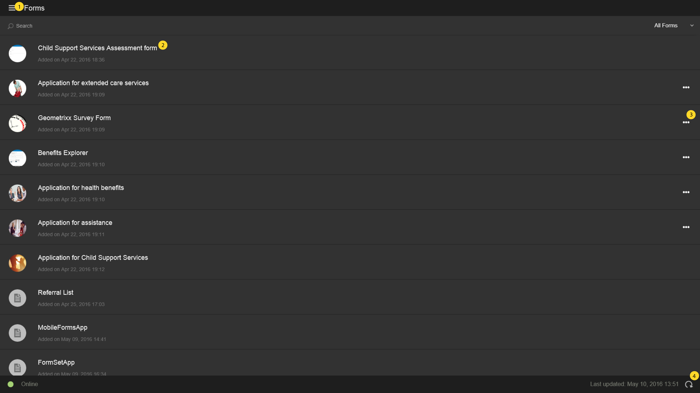
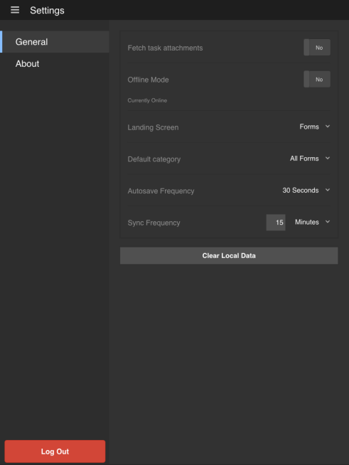

# Tela inicial{#home-screen}

>[!NOTE]
>
>As versões Android e iOS do aplicativo AEM Forms foram descontinuadas. A publicação do aplicativo Android na Google Play foi desfeita em setembro de 2026, e o aplicativo iOS foi removido do Apple App Store.
>Estes aplicativos não estão mais disponíveis para instalação. Para obter ajuda com o aplicativo Android, contate [aemformsapp-android@adobe.com](mailto:aemformsapp-android@adobe.com).

Ao fazer logon no aplicativo AEM Forms, você é redirecionado para a tela inicial.

## Tela inicial padrão {#default-home-screen}

Por padrão, a tela inicial exibe todos os formulários, incluindo pontos de partida e tarefas (se o servidor conectado estiver habilitado para o AEM Forms Workflow), juntamente com as miniaturas associadas. Você pode especificar as miniaturas no AEM Forms Server.

A figura a seguir é anotada com chamadas para os componentes essenciais na tela inicial padrão.

<!--
Click to enlarge

-->

1. **Botão Menu**: selecione o botão **Menu** para navegar até Tarefas, Forms, Caixa de Saída e Configurações. Se o aplicativo AEM Forms estiver conectado a um servidor AEM Forms JEE, você poderá ver a opção Tarefas. A opção Tarefas também armazena os rascunhos criados das tarefas em um processo. Para servidores OSGi da AEM Forms, a opção Tasks fica oculta. A caixa de saída armazena os formulários e rascunhos salvos antes de sincronizar com o servidor. Todos os formulários e rascunhos salvos na Caixa de Saída são carregados no AEM Forms Server quando o aplicativo está [sincronizado com o servidor](../../forms/using/sync-app.md). Para obter informações sobre Configurações, consulte [Atualizar Configurações Gerais](../../forms/using/update-general-settings.md).
1. **Tarefa ou Formulário**: selecione a tarefa ou o formulário listado com o qual deseja trabalhar.
1. **Reticências horizontais**: indica que as ações estão disponíveis para o formulário. Tocar nas reticências exibe as ações e a descrição fornecidas pelo autor. A opção **Excluir rascunho** e **Concluir** fica visível ao selecionar as reticências.
1. **Ícone Atualizar**: selecione o ícone atualizar para poder sincronizar seu aplicativo com o AEM Forms Server.

### Personalização da tela inicial {#customizing-the-home-screen}

Você pode alterar a tela inicial padrão do aplicativo a partir das **[Configurações gerais](../../forms/using/update-general-settings.md)** do aplicativo ou da guia **Preferência** no HTML Workspace.

A alteração feita na configuração da tela inicial no aplicativo afeta a tela inicial do usuário conectado no momento ou do usuário no dispositivo móvel atual.

No entanto, a alteração feita no HTML Workspace afeta todos os usuários do aplicativo AEM Forms conectados ao AEM Forms Server.
