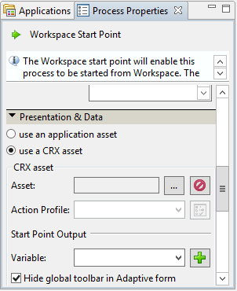

# Integração de aplicativos de terceiros ao espaço de trabalho do AEM Forms{#integrating-third-party-applications-in-aem-forms-workspace}

O espaço de trabalho do AEM Forms oferece suporte ao gerenciamento de atribuições de tarefas e atividades de conclusão de formulários e documentos. Esses formulários e documentos podem ser XDP Forms, Flex® Forms ou Guias (obsoletos) que foram renderizados nos formatos XDP, PDF, HTML ou Flex.

Esses recursos são aprimorados ainda mais. O AEM Forms agora oferece suporte à colaboração com aplicativos de terceiros que oferecem suporte a funcionalidades semelhantes ao espaço de trabalho do AEM Forms. Uma parte comum dessa funcionalidade é o fluxo de trabalho de atribuição e aprovação subsequente de uma tarefa. O AEM Forms fornece uma única experiência unificada para usuários corporativos do AEM Forms, para que todas essas atribuições de tarefas ou aprovações para os aplicativos compatíveis possam ser tratadas por meio do espaço de trabalho do AEM Forms.

Como exemplo, considere o Gerenciamento de correspondência como o candidato de amostra para integração com o espaço de trabalho do AEM Forms. O Gerenciamento de correspondências tem o conceito de uma &quot;Carta&quot;, que pode ser renderizada e permite ações.

## Criar ativos do Gerenciamento de correspondência {#create-correspondence-management-assets}

Comece criando um modelo de Gerenciamento de correspondência de amostra que é renderizado no espaço de trabalho do AEM Forms. Para obter mais detalhes, consulte [Criar um modelo de carta](../../forms/using/create-letter.md).

Acesse o modelo de Gerenciamento de correspondência em seu URL para verificar se o modelo de Gerenciamento de correspondência pode ser renderizado com sucesso. A URL tem um padrão semelhante a `https://'[server]:[port]'/lc/content/cm/createcorrespondence.html?cmLetterId=encodedLetterId&cmUseTestData=1&cmPreview=0;`

Onde `encodedLetterId` é a ID de letra codificada em URL. Especifique a mesma ID de correspondência ao definir o processo de renderização para a tarefa do espaço de trabalho no Workbench.

## Criar uma tarefa para renderizar e enviar uma carta no AEM Workspace {#create-a-task-to-render-and-submit-a-letter-in-aem-workspace}

Antes de executar essas etapas, verifique se você é membro dos seguintes grupos:

* cm-agent-users
* Usuários do Workspace

Para obter mais informações, consulte [Adicionar e configurar usuários](/help/forms/using/admin-help/adding-configuring-users.md).

Use as seguintes etapas para criar uma tarefa para renderizar e enviar uma carta no AEM Workspace:

1. Inicie o Workbench. Efetue logon no host local como administrador.
1. Clique em Arquivo > Novo > Aplicativo. No campo Nome do Aplicativo, digite `CMDemoSample` e clique em Concluir.
1. Selecione `CMDemoSample/1.0` e clique com o botão direito `NewProcess`. No campo de nome, digite `CMRenderer` e clique em Concluir.
1. Arraste o seletor de atividade Ponto de início e configure-o:

   1. Em Dados de Apresentação, selecione Usar um Ativo do CRX.

      

   1. Procurar um ativo. Na caixa de diálogo Selecionar ativo de formulário, a guia Cartas lista todas as cartas no servidor.

      

   1. Selecione a letra apropriada e clique em **OK**.

1. Clique em Gerenciar perfis de ação. A caixa de diálogo Gerenciar perfil de ação é exibida. Verifique se os processos Renderizar e Enviar estão selecionados corretamente.
1. Para abrir a carta com um arquivo XML de dados, procure e selecione o arquivo de dados apropriado no processo de preparação de dados.
1. Clique em OK.
1. Defina as variáveis para Saída do ponto inicial e Anexos da tarefa. As variáveis definidas contêm dados de Saída do ponto inicial e Anexos da tarefa.
1. (Opcional) Para adicionar outro usuário no fluxo de trabalho, arraste um seletor de atividade, configure-o e atribua-o a um usuário. Escreva um invólucro personalizado (exemplo fornecido abaixo) ou baixe e instale o DSC (fornecido abaixo) para extrair o modelo de carta, a saída do ponto inicial e o anexo da tarefa.

   Um exemplo de invólucro personalizado está listado abaixo:

   ```javascript
   public LetterInstanceInfo getLetterInstanceInfo(Document dataXML) throws Exception {
   try {
   if(dataXML == null)
   throw new Exception("dataXML is missing");
   
   CoreService coreService = getRemoteCoreService();
   if (coreService == null)
   throw new Exception("Unable to retrive service. Please verify connection details.");
   Map<String, Object> result = coreService.getLetterInstanceInfo(IOUtils.toString(dataXML.getInputStream(), "UTF-8"));
   LetterInstanceInfo letterInstanceInfo = new LetterInstanceInfo();
   
   List<Document> attachmentDocs = new ArrayList<Document>();
   List<byte[]> attachments = (List<byte[]>)result.get(CoreService.ATTACHMENT_KEY);
   if (attachments != null){
   for (byte[] attachment : attachments)
   { attachmentDocs.add(new Document(attachment)); }
   
   }
   letterInstanceInfo.setLetterAttachments(attachmentDocs);
   
   byte[] updateLayout = (byte[])result.get(CoreService.LAYOUT_TEMPLATE_KEY);
   if (updateLayout != null)
   { letterInstanceInfo.setLetterTemplate(new Document(updateLayout)); }
   
   else
   { throw new Exception("template bytes missing while getting Letter instance Info."); }
   
   return letterInstanceInfo;
   } catch (Exception e)
   { throw new Exception(e); }
   
   }
   ```

   [Obter arquivo](assets/dscsample.zip)
Baixar DSC: um DSC de amostra está disponível no arquivo DSCSample.zip anexado acima. Baixe e descompacte o arquivo DSCSample.zip. Antes de usar o serviço DSC, você deve configurá-lo. Consulte [Configurar o Serviço DSC](../../forms/using/add-action-button-in-create-correspondence-ui.md#p-configure-the-dsc-service-p).

   Na caixa de diálogo Definir atividade, selecione a atividade apropriada, como getLetterInstanceInfo, e clique em **OK**.

1. Implante o aplicativo. Se solicitado, faça check-in e salve os ativos.
1. Faça logon no espaço de trabalho de formulários do AEM em https://&#39;[server]:[port]&#39;/lc/content/ws.
1. Abra a tarefa que você adicionou, CMRenderer. A carta Gerenciamento de correspondência é exibida.

   

1. Preencha os dados necessários e envie a carta. A janela é fechada. Nesse processo, a tarefa é atribuída ao usuário especificado no workflow na etapa 9.

   >[!NOTE]
   >
   >O botão Enviar não é ativado até que todas as variáveis necessárias na correspondência sejam preenchidas.
