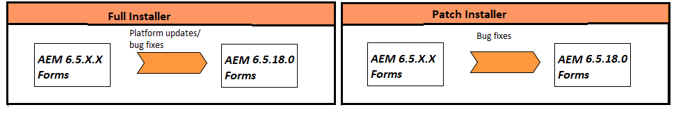

# Atualização para o AEM 6.5 Forms no JEE {#upgrade-to-aem-forms-jee}

O AEM 6.5.18.0 Forms no JEE fornece dois tipos de instaladores: instalador completo e instalador de patch.

**Instalador completo**: você pode usar o [AEM 6.5.18.0 no instalador completo do JEE](https://experienceleague.adobe.com/docs/experience-manager-release-information/aem-release-updates/forms-updates/aem-forms-releases.html) para configurar novas instâncias do AEM Forms ou executar atualizações do AEM 6.5.x.x Forms no JEE para o AEM 6.5.18.0 Forms no JEE.

O **Instalador de patch**: [AEM 6.5.18.0 no instalador de patch JEE](https://experienceleague.adobe.com/docs/experience-manager-release-information/aem-release-updates/forms-updates/aem-forms-releases.html) é para clientes que já usam as versões AEM 6.5.x.x. Você pode usar o instalador de patches para atualizar para a versão mais recente do AEM Forms.

A tabela a seguir mostra cenários de uso do instalador de patch e completo.

Execute o seguinte procedimento para usar o instalador completo para atualizar o AEM Forms 6.5.x.x existente no JEE para o AEM 6.5.18.0 Forms no JEE:

1. Baixe o instalador do AEM 6.5 Forms no JEE da [Distribuição de software](https://experience.adobe.com/#/downloads/content/software-distribution/br/aem.html). Você precisa de um contrato válido de Manutenção e Suporte para usar o instalador.
1. Consulte [Lista de verificação de atualização e planejamento](https://www.adobe.com/go/learn_aemforms_upgrade_checklist_65) para saber mais sobre as verificações a serem executadas para garantir uma atualização bem-sucedida.
1. Consulte [Preparar para atualizar para o AEM Forms](https://www.adobe.com/go/learn_aemforms_prepareupgrade_65) para aprender e executar as tarefas que garantem que a atualização seja executada corretamente com o mínimo de inatividade do servidor.
1. Dependendo do ambiente existente e do servidor de aplicativos, escolha um dos documentos a seguir e siga as instruções.

   * [Atualização do AEM 6.3 ou AEM 6.4 Forms para o AEM 6.5 Forms para JBoss](https://www.adobe.com/go/learn_aemforms_upgradeJBoss_65)
   * [Atualização do AEM 6.3 ou AEM 6.4 Forms para o AEM 6.5 Forms para WebSphere](https://www.adobe.com/go/learn_aemforms_upgradeWebSphere_65)
   * [Atualização do AEM 6.3 ou AEM 6.4 Forms para o AEM 6.5 Forms para JBoss Turnkey](https://www.adobe.com/go/learn_aemforms_upgradeTurnkey_65)

A atualização direta do LiveCycle ES2, LiveCycle ES3, AEM 6.0 Forms, AEM 6.1 Forms, AEM 6.2 Forms para o AEM 6.5 Forms não está disponível. Você pode executar uma atualização intermediária para uma ou mais versões do LiveCycle ou do AEM Forms e, em seguida, atualizar para o AEM 6.5 Forms. Para obter a lista de versões intermediárias e as instruções de atualização correspondentes, consulte [Escolher um caminho de atualização](upgrade.md).
