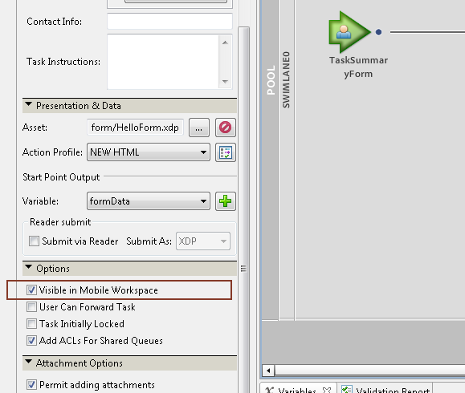

# Trabalhar com pontos iniciais{#working-with-startpoints}

Um ponto inicial invoca um processo criado no Workbench. Está associado a um formulário que chama o processo quando o formulário é enviado.

>[!NOTE]
>
>Os termos pontos de partida, processo de início e formulário são usados alternadamente ao se referirem a esse conceito.

Para iniciar um processo do aplicativo Forms do Adobe Experience Manager (AEM), você deve ter um ponto de partida do tipo **Workspace** em seu processo. Além disso, você deve selecionar a opção **[!UICONTROL Visível no Mobile Workspace]** para o ponto de partida.

**Para iniciar um processo definido no Workbench**

1. Para exibir os pontos iniciais disponíveis no aplicativo AEM Forms, vá para [Tela inicial](../../forms/using/home-screen.md).
1. Na tela **[!UICONTROL Página Inicial]**, por padrão, a lista **[!UICONTROL Todas as Forms]** é exibida.

   O ponto inicial está associado a um formulário. Selecione o ponto inicial associado ao formulário na lista para abri-lo.

   O formulário associado ao ponto inicial é aberto.

1. Insira os detalhes no formulário **[!UICONTROL Startpoint]**.

   Você pode adicionar anotações a esta tarefa usando o botão [anexo](../../forms/using/add-attachments.md).

1. Depois de preencher o formulário, clique no botão **[!UICONTROL Enviar]**.

Se o aplicativo estiver offline, o formulário e seus dados serão salvos na pasta Caixa de saída.

Se o aplicativo estiver online, a tarefa será sincronizada com o AEM Forms Server e atribuída ao usuário especificado no processo.

Para trabalhar com a tarefa na sua lista de tarefas, consulte [Abrindo uma tarefa](/help/forms/using/open-task.md).
