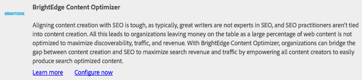
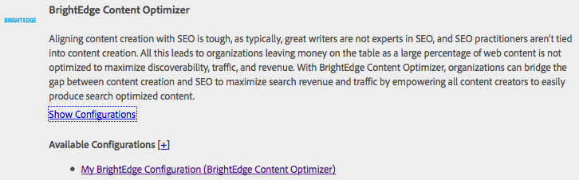
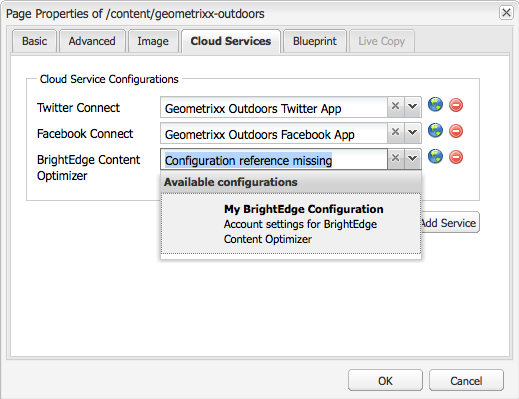
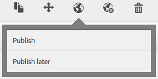
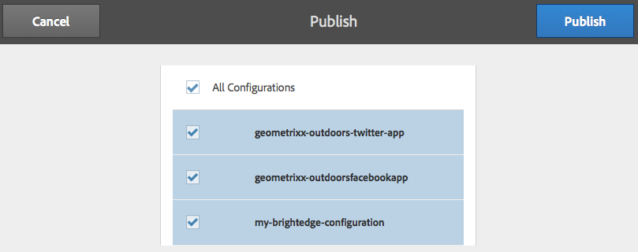

# Integração com o Otimizador de conteúdo BrightEdge{#integrating-with-brightedge-content-optimizer}

Crie uma configuração de nuvem do BrightEdge para que o AEM possa se conectar usando as credenciais da sua conta do BrightEdge. É possível criar várias configurações se você usar várias contas.

Ao criar a configuração, especifique um título. O título deve ser descritivo para que as pessoas possam correlacionar a configuração com a conta do BrightEdge. Quando um autor ou administrador de página associa uma página da Web à conta do BrightEdge, esse título é apresentado em uma lista suspensa.

1. No painel, clique em Ferramentas > Operações > Nuvem > Cloud Services.
1. Clique no link exibido na seção Otimizador de conteúdo BrightEdge. Se uma configuração do BrightEdge foi criada, determina o texto do link:

   * Configurar agora: esse link aparece quando nenhuma configuração foi criada.
   * Mostrar configurações: esse link aparece quando uma ou mais configurações são criadas.

   

1. Se você clicou em Mostrar configurações, clique no link + ao lado de Configurações disponíveis.
1. Digite um título para a configuração. Opcionalmente, digite um nome para o nó usado para armazenar a configuração no repositório. Clique em Criar.
1. Na caixa de diálogo Configuração do Otimizador de conteúdo BrightEdge, digite o nome de usuário e a senha da conta do BrightEdge e clique em OK.

## Editar uma configuração do BrightEdge {#editing-a-brightedge-configuration}

Modifique o nome de usuário e a senha de uma configuração do BrightEdge quando necessário. As modificações afetam todas as páginas que usam a configuração.

1. No painel, clique em Ferramentas > Operações > Nuvem > Cloud Services.
1. Na seção Otimizador de conteúdo BrightEdge, clique em Mostrar configurações.

   

1. Clique no nome da configuração que deseja editar.
1. Clique em Editar, modifique os valores de propriedade e clique em OK.

## Associar páginas a uma configuração do BrightEdge {#associating-pages-with-a-brightedge-configuration}

Associe páginas a uma configuração do BrightEdge para enviar dados de página ao serviço BrightEdge para análise. Quando você associa uma página a uma configuração, as páginas secundárias herdam a associação. Normalmente, você associa a página inicial do site para que os dados de todas as páginas sejam enviados para o BrightEdge.

1. Abra o console Sites clássico. ([http://localhost:4502/siteadmin#/content](http://localhost:4502/siteadmin#/content))
1. Na árvore Sites, selecione a pasta ou página que contém a página que você deseja associar à configuração do BrightEdge.
1. Na lista de páginas, clique com o botão direito do mouse na página que deseja configurar e clique em Propriedades.
1. Na guia Serviços em nuvem, clique no botão Adicionar serviço e, na caixa de diálogo Serviços em nuvem, selecione Otimizador de conteúdo BrightEdge e clique em OK.
1. Na lista Otimizador de conteúdo BrightEdge, selecione a configuração do BrightEdge a ser associada à página e clique em OK.

   

## Ativar uma configuração do BrightEdge {#activating-a-brightedge-configuration}

Ative uma configuração do BrightEdge para replicá-la na instância de publicação e ativar as páginas publicadas para interagir com o serviço BrightEdge.

1. No painel, clique em Sites e navegue até a página associada à configuração do BrightEdge e selecione-a.
1. Clique no ícone Publicar e em Publicar.

   

1. Na lista de configurações exibidas, verifique se a configuração do BrightEdge está selecionada e clique em Publicar.

   
