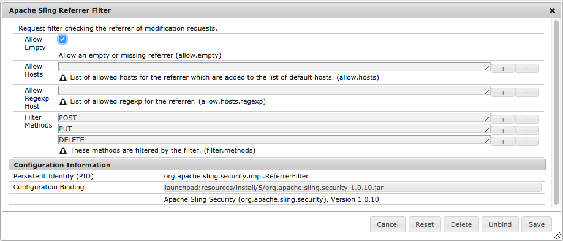

# Configuração do para aplicativos AEM{#configuring-for-aem-apps}

O Adobe Experience Manager Apps permite atualizar o conteúdo do OTA do seu aplicativo (no ar). O conteúdo atualizado é armazenado na instância de publicação. Para permitir que o aplicativo no dispositivo se conecte à instância de publicação e verifique se há atualizações, a instância de publicação deve ser configurada para permitir um cabeçalho de referenciador vazio.

## Configurar cabeçalho de referenciador vazio {#configuring-empty-referrer-header}

Para configurar o serviço de filtro de referenciador:

* Abra o console Apache Felix (**Configurações**) em:
* https://<server>:<port_number>/system/console/configMgr
* Faça logon como administrador.
* No menu **Configurações**, selecione: *Filtro de referenciador Apache Sling*
* Marque o campo Permitir vazio para permitir cabeçalhos de referenciador vazios/ausentes.
* Clique em **Salvar** para salvar as alterações.

Consulte as [Configurações OSGI](/help/sites-deploying/osgi-configuration-settings.md) e a [Lista de Verificação de Segurança - Problemas com Falsificação de Solicitação Entre Sites](/help/sites-administering/security-checklist.md#protect-against-cross-site-request-forgery) para obter mais detalhes.
