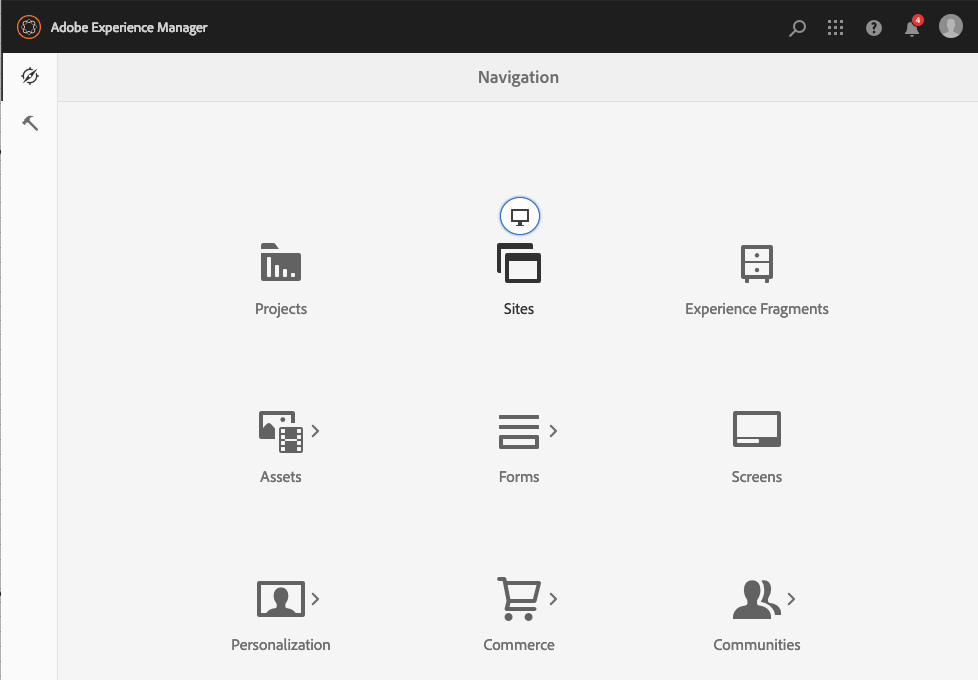

# Admin Console{#admin-consoles}

Por padrão, a capacidade de alternar para a interface clássica por meio dos consoles de Administração está desativada. Portanto, os ícones pop-up que eram vistos ao passar o mouse sobre determinados ícones do console, permitindo acesso à interface clássica, não são mais exibidos.

Todo console que tenha uma versão da interface clássica no `/libs/cq/core/content/nav` pode ser reabilitado individualmente para que a opção **Interface clássica** apareça novamente sobre o ícone do console quando for posicionada com o mouse.

Neste exemplo, você está reativando a interface clássica para o console Sites.

1. Usando o CRXDE Lite, localize o nó correspondente ao Admin Console para o qual você deseja reativar a interface clássica. Eles são encontrados em:

   `/libs/cq/core/content/nav`

   Por exemplo

   [`https://localhost:4502/crx/de/index.jsp#/libs/cq/core/content/nav`](https://localhost:4502/crx/de/index.jsp#/libs/cq/core/content/nav)

1. Selecione o nó correspondente ao console para o qual você deseja reativar a interface clássica. Neste exemplo, você está reativando a interface clássica para o console Sites.

   `/libs/cq/core/content/nav/sites`

1. Crie uma sobreposição usando a opção **Sobrepor Nó**; por exemplo:

   * **Caminho**: `/apps/cq/core/content/nav/sites`
   * **Local de Sobreposição**: `/apps/`
   * **Corresponder Tipos de Nó**: ativo (marque a caixa de seleção)

1. Adicione a seguinte propriedade booleana ao nó sobreposto:

   `enableDesktopOnly = {Boolean}true`

1. A opção **Interface Clássica** está novamente disponível como uma opção de pop-over no Admin Console.

   

Repita essas etapas para cada console para o qual deseja reativar o acesso à versão da interface clássica.
