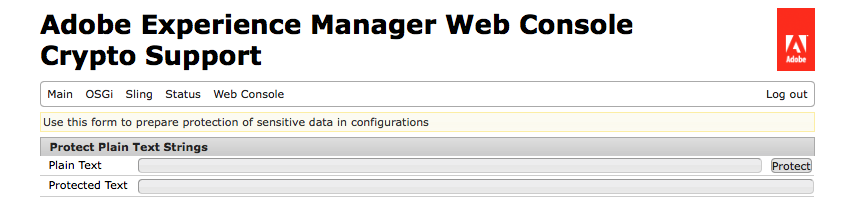

# Suporte de criptografia para propriedades de configuração{#encryption-support-for-configuration-properties}

## Visão geral {#overview}

Esse recurso permite que todas as propriedades de configuração do OSGi sejam armazenadas em um formulário criptografado protegido, em vez de texto não criptografado. O formulário na interface do usuário do Console da Web é usado para criar texto criptografado a partir de texto não criptografado usando a chave mestra de criptografia em todo o sistema.

O suporte ao OSGi Configuration Plugin foi adicionado para descriptografar a propriedade antes que ela fosse usada por um serviço.

>[!NOTE]
>
>Os serviços que esperam um valor criptografado precisam usar a verificação IsProtected para ver se o valor está criptografado antes de tentar descriptografá-lo, pois ele já pode ter sido descriptografado.

## Ativação do suporte de criptografia {#enabling-encryption-support}

Essas etapas mostram como criptografar a senha SMTP para o serviço de email. Você pode concluir essas etapas para uma propriedade OSGI que deseja criptografar.

1. Vá para o Console da Web do AEM em *https://&lt;serveraddress>:&lt;serverport>/system/console/configMgr*
1. No canto superior esquerdo, vá para **Principal - Suporte a criptografia**

   

1. A página **Suporte à Criptografia do Console da Web da Adobe Experience Manager** é exibida.

   

1. No campo **Texto sem formatação**, digite o texto dos dados confidenciais que deseja proteger.
1. Selecione **Proteger**. O texto protegido é exibido como texto criptografado.

   

1. Copie o Texto protegido da Etapa 5 e cole-o no valor de Formulário OSGI. Neste exemplo, a **senha SMTP** criptografada é adicionada ao *Day CQ Mail Service*.

   

1. Salve as propriedades do Day CQ Mail Service. A senha SMTP agora será enviada como um valor criptografado.

## Suporte para descriptografia {#decryption-support}

O AEM agora fornece um Plug-in de configuração para descriptografar propriedades de configuração. Este plug-in do AEM descriptografará e recuperará automaticamente as propriedades de texto não criptografado.
