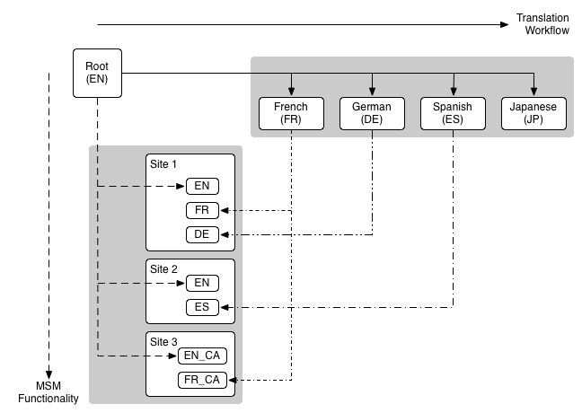

# Gerenciador multisite e tradução {#msm-and-translation}

As seguintes ferramentas administrativas estão disponíveis para gerenciar sites e páginas:

* O Gerenciador de vários sites (MSM) permite usar o conteúdo do mesmo site em vários locais, permitindo variações:

  * [Reutilizar conteúdo: Gerenciador multisite e Live Copy](/help/sites-administering/msm.md)

* A ferramenta de tradução permite automatizar a tradução de conteúdo da página, ativos e conteúdo gerado pelo usuário para criar e manter sites multilíngues:

  * [Tradução de conteúdo para sites multilíngues](/help/sites-administering/translation.md)

* Esses dois recursos podem ser combinados para atender a sites que são [Multinacionais e Multilíngues](#multinational-and-multilingual-sites).

## Sites multinacionais e multilíngues {#multinational-and-multilingual-sites}

É possível criar conteúdo para sites multinacionais e multilíngues com eficiência usando o Gerenciador multisite e o fluxo de trabalho de tradução. Crie um site principal em um idioma para um país específico e, em seguida, use esse conteúdo como base para os outros sites, usando a tradução quando necessário:

* [Traduzir](/help/sites-administering/translation.md) o site principal em diferentes idiomas.

* Use o [Gerenciador de vários sites](/help/sites-administering/msm.md) para:

  * Reutilizar o conteúdo do site principal e as traduções para criar sites para outros países e culturas.
  * Limite o uso do gerenciador de vários sites para conteúdo em um único idioma, por exemplo, inglês principal > ramificações de idioma inglês em sites de países, francês principal > ramificações de idioma francês em sites de países.
  * Quando necessário, desconecte elementos das live copies para adicionar detalhes de localização.

O diagrama a seguir ilustra como os principais conceitos se cruzam (mas não mostra todos os níveis/elementos envolvidos):

>[!NOTE]
>
>Neste cenário, e em situações comparáveis, o MSM não gerencia as diferentes versões de idioma dessa maneira.
>
>* O [MSM](/help/sites-administering/msm.md) gerencia a implantação do conteúdo traduzido de um blueprint (por exemplo, um conteúdo principal global) para as live copies (por exemplo, os sites locais), dentro dos limites de um idioma.
>* Os recursos de integração de [tradução](/help/sites-administering/translation.md) do AEM, juntamente com serviços de gerenciamento de tradução de terceiros, gerenciam os idiomas e a tradução de conteúdo para esses diferentes idiomas.
>
>Para casos de uso mais avançados, o MSM também pode ser usado com conteúdo principal de vários idiomas.

>[!NOTE]
>
>Em todos os casos de uso, é recomendável ler as seguintes práticas recomendadas:
>
>* [Práticas recomendadas para MSM](/help/sites-administering/msm-best-practices.md); especificamente:
>
>   * [Criar Site](/help/sites-administering/msm-best-practices.md#create-site)
>   * [MSM e sites multilíngues](/help/sites-administering/msm-best-practices.md#msm-and-multilingual-websites)
>
>* [Práticas recomendadas para tradução](/help/sites-administering/tc-bp.md)
