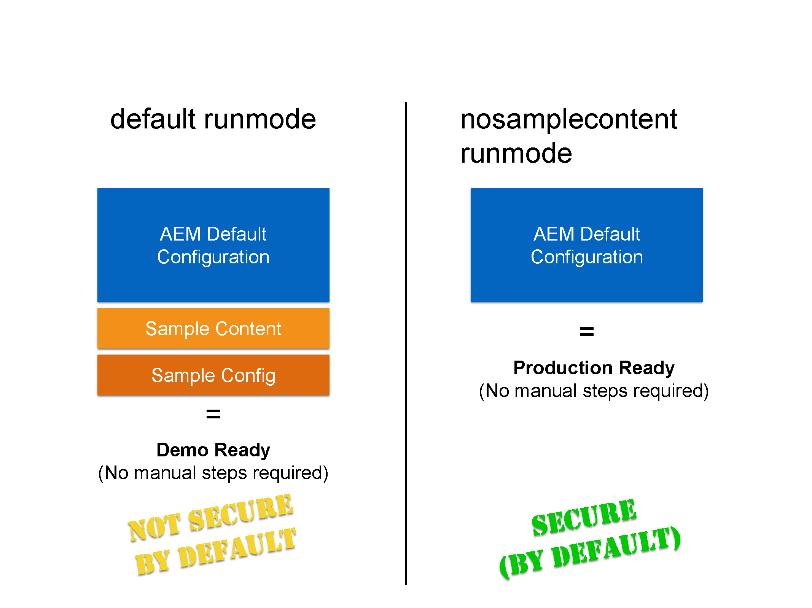

# Execução do AEM no modo de produção pronta{#running-aem-in-production-ready-mode}

Com o AEM 6.1, a Adobe apresenta o novo modo de execução `"nosamplecontent"`, cujo objetivo é automatizar as etapas necessárias para preparar uma instância do AEM para implantação em um ambiente de produção.

O novo modo de execução não só configurará automaticamente a instância para seguir as práticas recomendadas de segurança descritas na lista de verificação de segurança, como também removerá todos os aplicativos e configurações de amostra do Geometrixx no processo.

>[!NOTE]
>
>Como, por motivos práticos, o Modo de produção pronto do AEM cobrirá apenas a maioria das tarefas necessárias para proteger uma instância, é altamente recomendável consultar a [Lista de verificação de segurança](/help/sites-administering/security-checklist.md) antes de entrar em funcionamento com o ambiente de produção.
>
>Além disso, observe que a execução do AEM no Modo de produção pronto desativará efetivamente o acesso ao CRXDE Lite. Se for necessário para fins de depuração, consulte [Habilitação do CRXDE Lite no AEM](/help/sites-administering/enabling-crxde-lite.md).



Para executar o AEM no modo de produção pronto, basta adicionar o `nosamplecontent` por meio da opção de modo de execução `-r` aos argumentos de inicialização existentes:

```shell
java -jar aem-quickstart.jar -r nosamplecontent
```

Por exemplo, você pode usar a produção pronta para iniciar uma instância de autor com persistência MongoDB, desta forma:

```shell
java -jar aem-quickstart.jar -r author,crx3,crx3mongo,nosamplecontent -Doak.mongo.uri=mongodb://remoteserver:27017 -Doak.mongo.db=aem-author
```

## Altera parte do modo Pronto para produção {#changes-part-of-the-production-ready-mode}

Mais especificamente, as seguintes alterações de configuração são executadas quando o AEM é executado no modo pronto para produção:

1. O **Pacote de suporte do CRXDE** ( `com.adobe.granite.crxde-support`) está desabilitado por padrão no modo pronto para produção. Ele pode ser instalado a qualquer momento no repositório Maven público da Adobe. A versão 3.0.0 é necessária para o AEM 6.1.

1. O pacote **Apache Sling Simple WebDAV Access to repositories** ( `org.apache.sling.jcr.webdav`) só estará disponível nas instâncias **author**.

1. Usuários recém-criados precisam alterar a senha no primeiro logon. Isso não se aplica ao usuário administrador.
1. **Gerar informações de depuração** está desabilitado para o **Apache Sling JavaScript Handler**.

1. **O conteúdo mapeado** e **Gerar informações de depuração** estão desabilitados para o **Manipulador de Script JSP do Apache Sling**.

1. O **Filtro WCM CQ de Dia** está definido como `edit` no **autor** e `disabled` em **publicar** instâncias.

1. O **Gerenciador de Bibliotecas de HTML do Adobe Granite** está configurado com as seguintes configurações:

   1. **Minificar:** `enabled`
   1. **Depurar:** `disabled`
   1. **Gzip:** `enabled`
   1. **Horário:** `disabled`

1. O **Apache Sling GET Servlet** está definido para oferecer suporte a configurações seguras por padrão, da seguinte maneira:

| **Configuração** | **Autor** | **Publicar** |
|---|---|---|
| Representação TXT | desabilitado | desabilitado |
| Representação do HTML | desabilitado | desabilitado |
| Representação JSON | habilitado | habilitado |
| Representação XML | desabilitado | desabilitado |
| json.maximumresults | 1000 | 100 |
| Índice automático | desabilitado | desabilitado |
