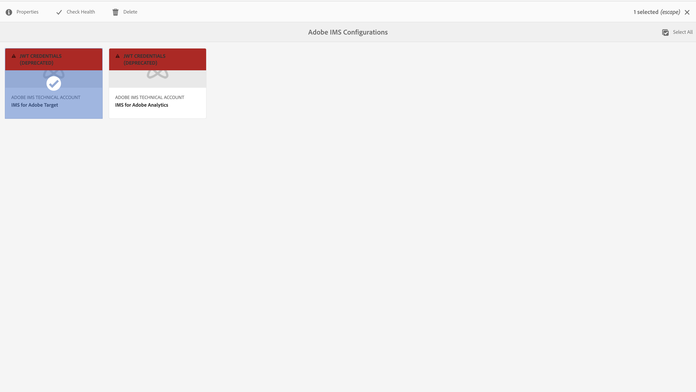
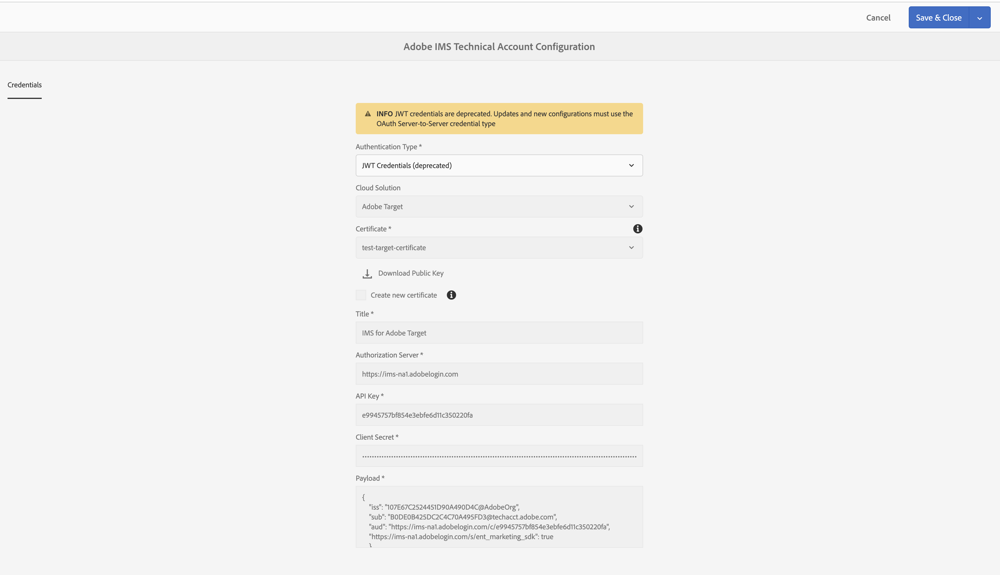

# Configuração de integrações do IMS para o AEM {#setting-up-ims-integrations-for-aem}

>[!NOTE]
>
>Os clientes do Adobe usam o [Adobe Developer Console](https://developer.adobe.com/console) para gerar credenciais que habilitam o acesso a várias APIs. Os clientes selecionam entre vários tipos de credenciais, que variam de servidor para servidor do OAuth a aplicativo de página única. O tipo de credencial Conta de serviço (JWT) agora está obsoleto em favor das credenciais de servidor para servidor do OAuth.

O Adobe Experience Manager (AEM) pode ser integrado a muitas outras soluções da Adobe. Por exemplo, Adobe Target, Adobe Analytics e outros.

As integrações usam uma integração IMS, configurada com S2S OAuth.

* Depois de criar:

  * [Credenciais na Developer Console](#credentials-in-the-developer-console)

* Em seguida, é possível:

  * Criar uma (nova) [configuração do OAuth](#creating-oauth-configuration)

  * [Migrar uma configuração JWT existente para uma configuração OAuth](#migrating-existing-JWT-configuration-to-oauth)

>[!CAUTION]
>
>Anteriormente, as configurações eram feitas com [Credenciais JWT que agora estão sujeitas a desativação no Adobe Developer Console](/help/sites-administering/jwt-credentials-deprecation-in-adobe-developer-console.md).
>
>Essas configurações não podem mais ser criadas ou atualizadas, mas podem ser migradas para configurações OAuth.

## Credenciais na Developer Console {#credentials-in-the-developer-console}

Como primeira etapa, você deve configurar as credenciais do OAuth no Adobe Developer Console.

Para obter detalhes sobre como fazer essa configuração, consulte a documentação do Developer Console, dependendo das suas necessidades:

* Visão geral:

  * [Autenticação de servidor para servidor](https://developer.adobe.com/developer-console/docs/guides/authentication/ServerToServerAuthentication/)

* Criação de uma nova credencial OAuth:

  * [Guia de implementação de credenciais do OAuth de servidor para servidor](https://developer.adobe.com/developer-console/docs/guides/authentication/ServerToServerAuthentication/implementation)

* Migrar uma credencial JWT existente para uma credencial OAuth:

  * [Migração da credencial de conta de serviço (JWT) para a credencial de servidor para servidor do OAuth](https://developer.adobe.com/developer-console/docs/guides/authentication/ServerToServerAuthentication/migration)

Por exemplo:

## Criação de uma configuração OAuth {#creating-oauth-configuration}

Para criar uma nova Integração do Adobe IMS usando o OAuth:

1. No AEM, navegue até **Ferramentas**, **Segurança**, **Integração do Adobe IMS**.

1. Selecione **Criar**.

1. Conclua a configuração com base nos detalhes da [Developer Console](https://developer.adobe.com/developer-console/docs/guides/authentication/ServerToServerAuthentication/implementation). Por exemplo:

   

1. **Salve** suas alterações.

## Migração de uma configuração JWT existente para uma configuração OAuth {#migrating-existing-JWT-configuration-to-oauth}

Para migrar uma Integração do Adobe IMS existente com base em credenciais JWT:

>[!NOTE]
>
>Este exemplo mostra uma Configuração IMS do Launch.

1. No AEM, navegue até **Ferramentas**, **Segurança**, **Integração do Adobe IMS**.

1. Selecione a configuração JWT que precisa ser migrada. As configurações JWT estão marcadas com o aviso **Credenciais JWT (obsoletas)**.

1. Selecionar **Propriedades**:

   

1. A configuração é aberta como somente leitura:

   

1. Selecione **OAuth** na lista suspensa **Tipo de Autenticação**:

   

1. As propriedades disponíveis são atualizadas. Use os detalhes do Developer Console para concluí-los:

   

1. Use **Salvar e fechar** para manter suas atualizações.
Quando você retornar ao console, o aviso **Credenciais JWT (obsoletas)** desaparecerá.
