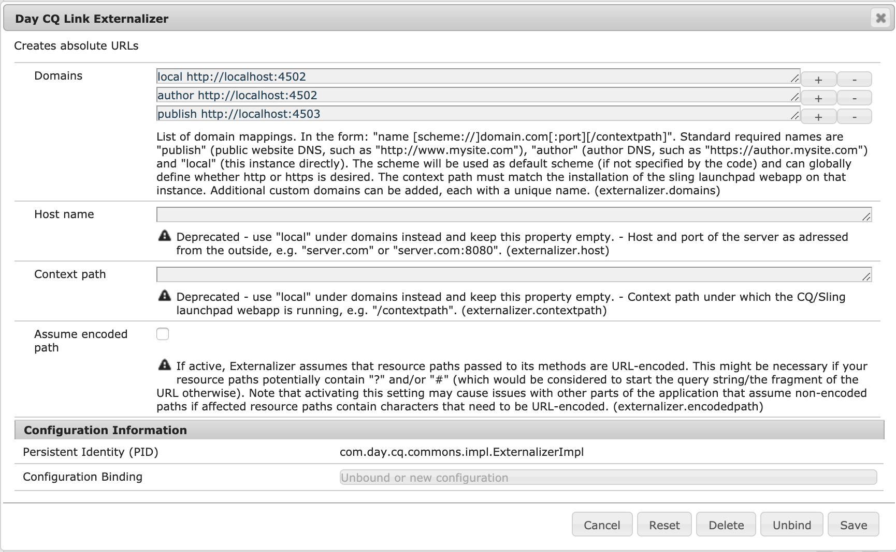

# Pré-requisitos para integração com o Adobe Target{#prerequisites-for-integrating-with-adobe-target}

Como parte da [integração do AEM e do Adobe Target](/help/sites-administering/target.md), é necessário se registrar no Adobe Target, definir o agente de replicação e as configurações de atividade segura no nó de publicação.

## Registrar-se na Adobe Target {#registering-with-adobe-target}

Para integrar o AEM com o Adobe Target, é necessário ter uma conta válida do Adobe Target. Esta conta deve ter no mínimo o nível de permissões **aprovador**. Ao se registrar na Adobe Target, você recebe um código de cliente. Você precisa do código de cliente e seu nome de logon e senha do Adobe Target para conectar o AEM ao Adobe Target.

O código de cliente identifica a conta de cliente do Adobe Target ao chamar o servidor do Adobe Target.

>[!NOTE]
>
>A equipe do Target deve habilitar sua conta para usar a integração.
>
>Se esse não for o caso, entre em contato com o [Atendimento ao cliente da Adobe](https://experienceleague.adobe.com/en/docs/target/using/cmp-resources-and-contact-information).

## Habilitar o agente de replicação de destino {#enabling-the-target-replication-agent}

O [agente de replicação](/help/sites-deploying/replication.md) de Teste e Destino deve estar habilitado na instância do autor. Observe que este agente de replicação não está habilitado por padrão se você usou o modo de execução [nosamplecontent](/help/sites-deploying/configure-runmodes.md#using-samplecontent-and-nosamplecontent) para instalar o AEM. Para obter mais informações sobre como proteger seu ambiente de produção, consulte a [Lista de Verificação de Segurança](/help/sites-administering/security-checklist.md).

1. Na página inicial do AEM, clique em **Ferramentas** > **Implantação** > **Replicação**.
1. Clique Em **Agentes No Autor**.
1. Clique no agente de replicação **Testar e Destino (teste e destino)** e em **Editar**.
1. Selecione a opção Habilitado e clique em **OK**.

   >[!NOTE]
   >
   >Ao configurar o agente de replicação Test and Target, na guia **Transport**, o URI é definido por padrão como `tnt:///`. Não substitua este URI por `https://admin.testandtarget.omniture.com`.
   >
   >Se você tentar testar a conexão com `tnt:///`, isso mostrará um erro que é o comportamento esperado. O motivo é porque o URI é somente para uso interno. Não usar com **Testar Conexão**.

## Proteger o nó de configurações de atividade {#securing-the-activity-settings-node}

Proteja o nó de configurações de atividade **cq:ActivitySettings** na instância de publicação para que ele fique inacessível aos usuários normais. O nó de configurações de atividade só deve estar acessível ao serviço que lida com a sincronização de atividades com o Adobe Target.

O nó **cq:ActivitySettings** está disponível no CRXDE Lite em `/content/campaigns/*nameofbrand*`* *sob o nó de atividades `jcr:content`. Por exemplo, `/content/campaign/we-retail/master/myactivity/jcr:content/cq:ActivitySettings`. Esse nó só é criado depois de direcionar um componente.

O nó **cq:ActivitySettings** sob `jcr:content` da atividade está protegido pelas seguintes ACLs:

* Negue tudo para todos.
* Permitir `jcr:read,rep:write` para `target-activity-authors` (o autor é membro deste grupo imediatamente).
* Permitir `jcr:read,rep:write` para `targetservice`.

Essas configurações garantem que os usuários normais não tenham acesso às propriedades do nó. Use as mesmas ACLs no autor e na publicação. Consulte [Administração e Segurança do Usuário](/help/sites-administering/security.md) para obter mais informações.

## Configurar o Externalizador de links do AEM {#configuring-the-aem-link-externalizer}

Ao editar uma atividade no Adobe Target, a URL aponta para **localhost**, a menos que você altere a URL no nó do autor do AEM. Você pode configurar o Externalizador de links do AEM se quiser que o conteúdo exportado aponte para um domínio *publicar* específico.

>[!NOTE]
>
>Consulte também [Adicionar a configuração da nuvem](/help/sites-administering/experience-fragments-target.md#add-the-cloud-configuration).

Para configurar o Externalizador do AEM:

>[!NOTE]
>
>Para obter mais detalhes, consulte [Externalizar URLs](/help/sites-developing/externalizer.md).

1. Navegue até o console da Web do OSGi em **https://&lt;server>:&lt;port>/system/console/configMgr.**
1. Localize o **Day CQ Link Externalizer** e insira o domínio para o nó do autor.

   
