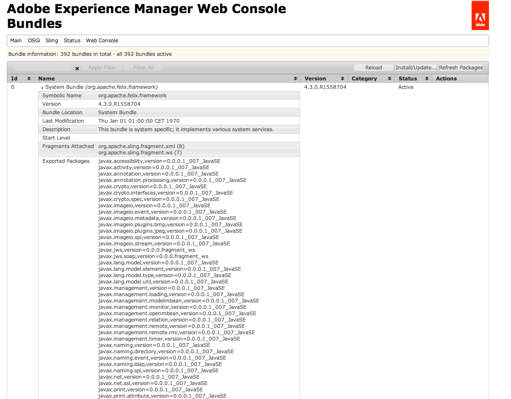

# Solução de problemas do Adobe Experience Manager {#troubleshooting-aem}

A seção a seguir aborda alguns problemas que você pode encontrar ao usar o AEM (Adobe Experience Manager), juntamente com sugestões sobre como solucioná-los.

>[!NOTE]
>
>Se você estiver solucionando problemas de criação no AEM, consulte [Solução de problemas para autores.](/help/sites-authoring/troubleshooting.md)

>[!NOTE]
>
>Quando você tiver problemas, também vale a pena verificar a lista de [Problemas conhecidos](/help/release-notes/release-notes.md) para sua instância (versão e service packs).

## Cenários de solução de problemas para administradores {#troubleshooting-scenarios-for-administrators}

A tabela a seguir fornece uma visão geral dos problemas que os administradores podem solucionar:

<table>
 <tbody>
  <tr>
   <td><strong>Função</strong></td>
   <td><strong>Problema </strong></td>
  </tr>
  <tr>
   <td>Administrador do sistema</td>
   <td>
Clicar duas vezes no jar Quickstart não tem efeito ou abre o arquivo jar com outro programa (por exemplo, gerenciador de arquivos)
 </td>
  </tr>
  <tr>
   <td>
Administrador do sistema
 </td>
   <td>
Meu aplicativo em execução no CRX emite erros de memória insuficiente
 </td>
  </tr>
  <tr>
   <td>
Administrador do sistema
 </td>
   <td>
A tela de boas-vindas do AEM não é exibida no navegador após clicar duas vezes no AEM CM Quickstart
 </td>
  </tr>
  <tr>
   <td>
Administrador do sistema
 
usuário administrador
 </td>
   <td>
Fazendo um despejo de encadeamento
 </td>
  </tr>
  <tr>
   <td>
Administrador do sistema
 
usuário administrador
 </td>
   <td>
Verificando sessões JCR não fechadas
 </td>
  </tr>
 </tbody>
</table>

## Métodos de análise de solução de problemas {#methods-for-troubleshooting-analysis}

### Fazendo um despejo de encadeamento {#making-a-thread-dump}

O despejo de thread é uma lista de todas as threads do Java™ que estão ativas no momento. Se o AEM não responder corretamente, o despejo de thread poderá ajudar a identificar bloqueios ou outros problemas.

### Uso do Sling Thread Dumper {#using-sling-thread-dumper}

1. Abra o **AEM Web Console**; por exemplo, em `https://localhost:4502/system/console/`.
1. Selecione a guia **Threads** em **Status**.

### Usando jstack (linha de comando) {#using-jstack-command-line}

1. Localize o PID (ID do processo) da instância do AEM Java™.

   Por exemplo, você pode usar `ps -ef` ou `jps`.

1. Executar:

   `jstack <pid>`

1. Mostra o despejo de thread.

>[!NOTE]
>
>Você pode anexar os despejos de thread a um arquivo de log usando o redirecionamento de saída `>>`:
>
>`jstack <pid> >> /path/to/logfile.log`

Consulte a documentação [Como remover despejos de thread de uma JVM](https://experienceleague.adobe.com/docs/experience-cloud-kcs/kbarticles/KA-17452.html?lang=pt-BR) para obter mais informações

### Verificando sessões JCR não fechadas {#checking-for-unclosed-jcr-sessions}

Quando a funcionalidade é desenvolvida para o AEM WCM, as sessões JCR podem ser abertas (comparável à abertura de uma conexão de banco de dados). Se as sessões abertas nunca forem fechadas, o sistema pode apresentar os seguintes sintomas:

* O sistema fica mais lento.
* Você pode ver grande parte das entradas do CacheManager: resizeAll no arquivo de log; o seguinte número (tamanho=&lt;x>) shows the number of caches, each session opens several caches.
* Periodicamente, o sistema fica sem memória (após algumas horas, dias ou semanas - dependendo da gravidade).

Para começar a analisar sessões não fechadas, consulte o artigo da Base de Dados de Conhecimento [Unclosed Resource Resolver](https://experienceleague.adobe.com/pt-br/docs/experience-cloud-kcs/kbarticles/ka-23761).

### Uso do console da Web do Adobe Experience Manager {#using-the-adobe-experience-manager-web-console}

O status dos pacotes OSGi também pode fornecer uma indicação antecipada de possíveis problemas.

1. Abra o **AEM Web Console**; por exemplo, em `https://localhost:4502/system/console/`.
1. Selecione **Pacotes** na guia **OSGI**.
1. Verificar:

   * o Status dos pacotes. Se algum estiver Inativo ou Insatisfeito, tente parar e reiniciar o pacote. Se o problema persistir, investigue mais usando outros métodos.
   * se algum dos pacotes tem dependências ausentes. Esses detalhes podem ser vistos ao clicar no Nome do pacote individual, que é um link (o exemplo a seguir não tem problemas):

