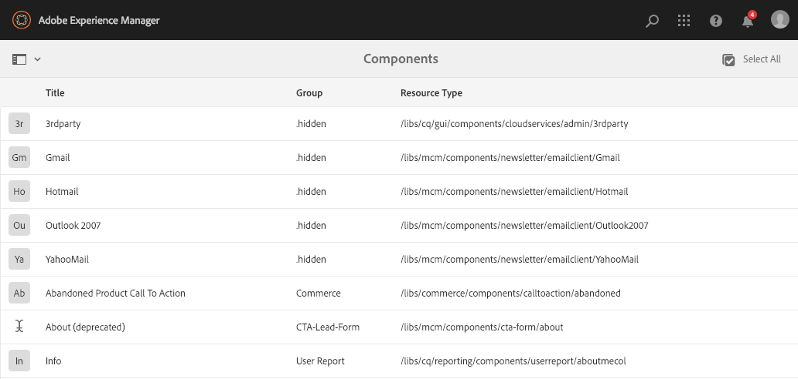
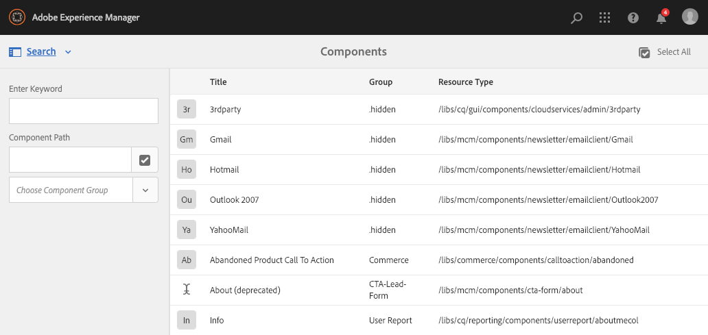
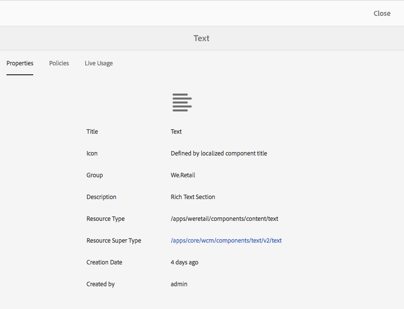
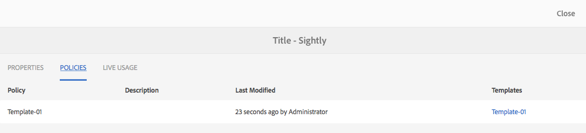
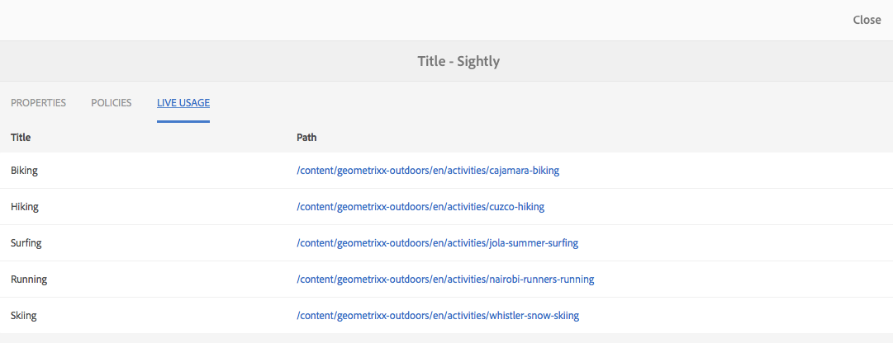
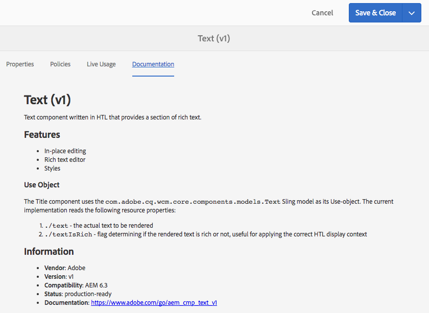

# Console de componentes{#components-console}

O console Componentes permite navegar em todos os componentes definidos para a instância e visualizar as principais informações de cada componente.

Ele pode ser acessado em **Ferramentas >** **Geral >** **Componentes**. No console, as visualizações em Cartão e Lista estão disponíveis. Como não há estrutura em árvore para componentes, a exibição em coluna não está disponível.

>[!NOTE]
>
>O console Componentes mostra todos os componentes do sistema. O [Navegador de componentes](/help/sites-authoring/author-environment-tools.md#components-browser) mostra componentes que estão disponíveis para autores e oculta todos os grupos de componentes que começam com um ponto final ( `.`).

## Pesquisar {#searching}

Com o ícone **Apenas conteúdo** (na parte superior esquerda), você pode abrir o painel **Pesquisar** para pesquisar e/ou filtrar os componentes:

### Detalhes do componente {#component-details}

Para exibir detalhes sobre um componente específico, clique no recurso desejado. Três guias fornecem:

* **Propriedades**

  

  Na guia Propriedades, é possível:

  * Veja as propriedades gerais do componente.
  * Visualizar como o [ícone ou abreviação foi definido](/help/sites-developing/components-basics.md#component-icon-in-touch-ui) para o componente.

    * Clicar na origem do ícone levará você ao componente.

  * Exiba o **Tipo de Recurso** e o **Supertipo de Recurso** (se definido) do componente.

    * Clicar no Supertipo de recurso levará você a esse componente.

  >[!NOTE]
  >
  >Como `/apps` não pode ser editado no tempo de execução, o console Componentes fica somente leitura.

* **Políticas**

  

* **Uso em tempo real**

  

  >[!CAUTION]
  >
  >Devido à natureza das informações coletadas para esta exibição, ela pode levar algum tempo para ser agrupada/exibida.

* **Documentação**

  Se o desenvolvedor tiver fornecido a [documentação referente ao componente](/help/sites-developing/developing-components.md#documenting-your-component), ela aparecerá na guia **Documentação**. Se não houver documentação disponível, a guia **Documentação** não será exibida.

  
