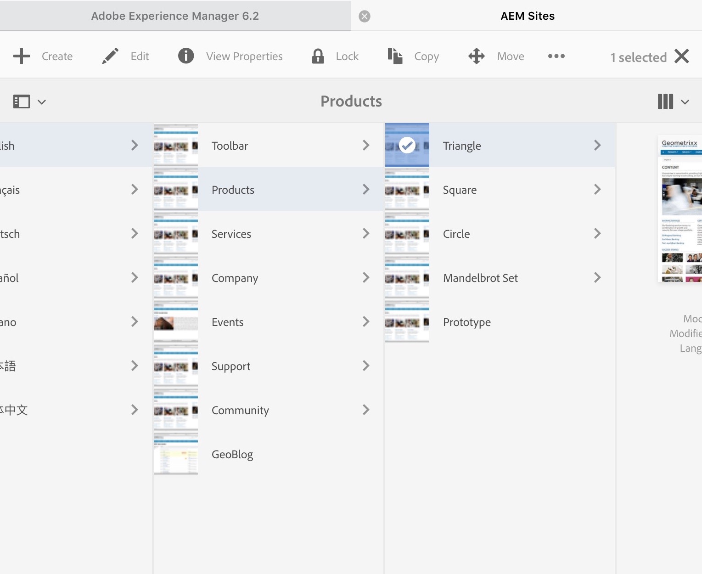

# Trabalhar com o ambiente de autor{#working-with-the-author-environment}

>[!NOTE]
>
>A documentação a seguir se concentra na interface clássica. Para obter informações sobre a criação na interface moderna e habilitada para toque, consulte a [documentação sobre criação padrão](/help/assets/assets.md).

O ambiente de criação permite executar tarefas relacionadas a:

* [Criação](/help/sites-authoring/author.md) (incluindo [criação de páginas](/help/sites-authoring/qg-page-authoring.md) e [gerenciamento de ativos](/help/assets/assets.md))

* [Administrando](/help/sites-administering/administer-best-practices.md) tarefas necessárias ao gerar e manter o conteúdo em seu site

Para isso, são fornecidas duas interfaces gráficas de usuário, que podem ser acessadas em qualquer navegador moderno:

1. IU Clássica

   * Essa interface sempre esteve disponível no AEM por muitos anos.
   * É predominantemente verde.
   * Ele foi projetado para uso em dispositivos desktop.
   * Ele não é mais mantido.
   * A documentação a seguir se concentra nessa interface clássica. Para obter informações sobre criação na interface moderna baseada em toque, consulte a [documentação sobre criação padrão](/help/sites-authoring/author.md).

   

1. Interface de usuário habilitada para toque

   * Esta é a interface do usuário moderna e padrão do AEM.
   * É predominantemente cinza, com uma interface limpa e plana.
   * Ele foi projetado para uso em dispositivos de toque e desktop (otimizado para toque). A aparência é a mesma em todos os dispositivos, embora a [exibição e seleção dos recursos](/help/sites-authoring/basic-handling.md) seja um pouco diferente (toques em vez de cliques).
   * Consulte a [documentação de criação padrão](/help/sites-authoring/author.md) para obter mais detalhes sobre como criar usando a interface baseada em toque. A documentação a seguir se concentra na interface clássica.

   * Área de trabalho:

   

   * Dispositivos tablet (ou desktop com menos de 1024 pixels de largura):

   
