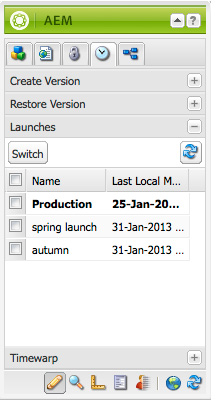

# Edição de inicializações{#editing-launches}

## Editar páginas de lançamento {#editing-launch-pages}

Quando uma inicialização é criada para uma página (ou conjunto de páginas), é possível editar o conteúdo na cópia de inicialização das páginas.

1. Abra a página para edição.
1. No Sidekick, selecione a guia **Controle de Versão** e expanda o grupo **Inicializações**. O título do lançamento que está sendo editado no momento usa uma fonte em negrito.

   

1. Selecione a inicialização na qual deseja trabalhar e clique em **Alternar**.
1. Comece a editar.

   >[!NOTE]
   >
   >Você pode usar a guia **Página** do sidekick para executar ações como **Criar página secundária**, entre outras.

## Editar uma configuração de lançamento {#editing-a-launch-configuration}

Depois de criar um lançamento, é possível alterar o nome do lançamento e a data do lançamento. Você também pode especificar uma imagem para associar ao lançamento.

1. Abra a página de administração de inicializações ([http://localhost:4502/libs/launches/content/admin.html](http://localhost:4502/libs/launches/content/admin.html)).

1. Selecione a inicialização necessária e clique em **Editar** para abrir a caixa de diálogo:

   * Na guia **Geral**, você pode editar:

     * **Título**
     * **Data de ativação**: é equivalente à data de lançamento
     * **Pronto para produção**

     Consulte [Inicializações - a Ordem dos Eventos](/help/sites-authoring/launches.md#launches-the-order-of-events) para obter informações sobre a finalidade e interação desses campos.

   * Na guia **Imagem**, você pode carregar um arquivo de imagem.

1. Clique em **Salvar**.

## Descobrir o status de lançamento de uma página {#discovering-the-launch-status-of-a-page}

Quando você está editando uma inicialização de uma página, as informações sobre a inicialização aparecem na parte inferior da guia **Versionamento** do Sidekick:

* O nome da inicialização.
* O tempo desde a última alteração.
* O usuário que executou a última alteração.
* O status do sinalizador **Pronto para Produção** (laranja=não definido; verde=definido).

