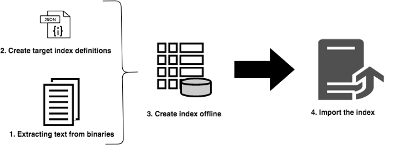
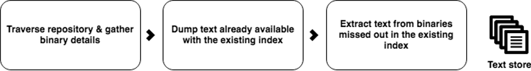
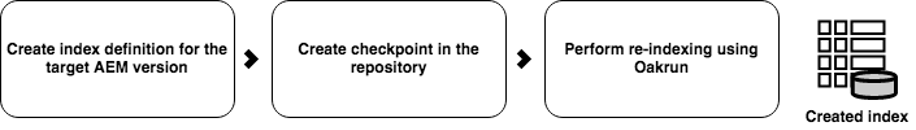

# Reindexação offline para o AEM {#offline-reindexing-for-aem}

## Introdução {#introduction}

Para projetos do AEM Assets, que normalmente têm grandes armazenamentos de dados e um alto nível de uploads de ativos, a reindexação de índices do Oak pode levar um tempo significativo.

Esta seção descreve como usar a ferramenta de execução do Oak para executar a reindexação offline. As etapas apresentadas podem ser aplicadas a índices [Lucene](https://jackrabbit.apache.org/oak/docs/query/lucene.html) para versões AEM 6.4 e superiores.

## Visão geral {#overview}

Os repositórios do AEM geralmente exigem reindexação devido a vários motivos, como alterações na definição do índice, otimização do desempenho ou após alterações significativas no conteúdo. A reindexação é cara para implantações de ativos, pois o texto em ativos (por exemplo, texto em arquivos PDF) é extraído e indexado. Com repositórios MongoMK, os dados são mantidos pela rede, aumentando ainda mais a quantidade de tempo que a reindexação leva. A solução é executar a reindexação **offline** usando a ferramenta de execução do Oak e, em seguida, importar os índices pré-criados para a instância do AEM em execução. Essa abordagem minimiza o tempo de reindexação e permite um melhor gerenciamento de recursos.

## Abordagem {#approach}



A ideia é criar os índices offline usando a ferramenta [Oak-run](/help/sites-deploying/indexing-via-the-oak-run-jar.md) e, em seguida, importá-los para a instância do AEM em execução. O diagrama acima mostra a abordagem de reindexação offline.

Além disso, esta é a ordem das etapas, conforme descrito na abordagem:

1. O texto de binários é extraído primeiro
2. As definições de índice são criadas ou atualizadas
3. Os índices offline foram criados
4. Os índices são importados para a instância do AEM em execução

### Extração de texto {#text-extraction}

Para ativar a indexação completa no AEM, o texto de binários, como o PDF, é extraído e adicionado ao índice. Essa é geralmente uma etapa cara no processo de indexação. A extração de texto é uma etapa de otimização defendida especialmente para reindexar repositórios de ativos, pois eles armazenam grandes números de binários.



O texto de binários armazenados no sistema pode ser extraído usando a ferramenta oak-run com a biblioteca tika. Um clone do sistema de produção pode ser obtido e usado para esse processo de extração de texto. Esse processo cria o armazenamento de texto, executando as seguintes etapas:

**1. Percorrer o repositório e coletar os detalhes de binários**

Essa etapa produz um arquivo CSV contendo uma tupla de binários, um caminho e uma ID de blob.

Execute o comando abaixo no diretório a partir do qual deseja criar o índice. O exemplo abaixo presume o diretório inicial do repositório.

```
java java -jar oak-run.jar tika <nodestore path> --fds-path <datastore path> --data-file text-extraction/oak-binary-stats.csv --generate
```

Onde `nodestore path` é `mongo_uri` ou `crx-quickstart/repository/segmentstore/`

Use o parâmetro `--fake-ds-path=temp` em vez de `–fds-path` para acelerar o processo.

**2. Reutilizar o armazenamento de texto binário disponível no índice existente**

Despeje os dados de índice do sistema existente e extraia o armazenamento de texto.

Você pode despejar os dados de índice existentes usando o seguinte comando:

```
java -jar oak-run.jar index <nodestore path> --fds-path=<datastore path> --index-dump
```

Onde `nodestore path` é `mongo_uri` ou `crx-quickstart/repository/segmentstore/`

Em seguida, use o despejo de índice acima para preencher o armazenamento:

```
java -jar oak-run.jar tika --data-file text-extraction/oak-binary-stats.csv --store-path text-extraction/store --index-dir ./indexing-result/index-dumps/<oak-index-name>/data populate
```

Onde `oak-index-name` é o nome do índice de texto completo, por exemplo, &quot;lucene&quot;.

**3. Execute o processo de extração de texto usando a biblioteca tika para os binários perdidos na etapa acima**

```
java -cp oak-run.jar:tika-app-*.jar org.apache.jackrabbit.oak.run.Main tika --data-file text-extraction/oak-binary-stats.csv --store-path text-extraction/store --fds-path <datastore path> extract
```

>[!NOTE]
>
>Use a mesma versão do Tika que está sendo usada no AEM.

Onde `datastore path` é o caminho para o armazenamento de dados binários.

O armazenamento de texto criado pode ser atualizado e reutilizado para cenários de reindexação futuros.

Para obter mais detalhes sobre o processo de extração de texto, consulte a [documentação de execução do Oak](https://jackrabbit.apache.org/oak/docs/query/pre-extract-text.html).

### Reindexação offline {#offline-reindexing}



Crie o índice Lucene offline. Se estiver usando MongoMK, é recomendável executá-lo diretamente em um dos nós MongoMK, pois isso evita a sobrecarga da rede.

Para criar o índice offline, siga as etapas abaixo:

**1. Gerar definições de índice Oak Lucene**

Despejar as definições de índice existentes. As definições de índice podem ser geradas usando o pacote de repositório do Adobe Granite e o oak-run.

Para despejar a definição de índice da instância do AEM, execute este comando:

>[!NOTE]
>
>Para obter mais detalhes sobre definições de índice de dumping, consulte a [documentação do Oak](https://jackrabbit.apache.org/oak/docs/query/oak-run-indexing.html#async-index-data).

```
java -jar oak-run.jar index --fds-path <datastore path> <nodestore path> --index-definitions
```

Onde `datastore path` e `nodestore path` são da instância do AEM.

Em seguida, gere definições de índice usando o pacote de repositório adequado do Granite.

```
java -cp oak-run.jar:bundle-com.adobe.granite.repository.jar org.apache.jackrabbit.oak.index.IndexDefinitionUpdater --in indexing-definitions_source.json --out merge-index-definitions_target.json --initializer com.adobe.granite.repository.impl.GraniteContent
```

>[!NOTE]
>
>O processo de criação de definição de índice acima tem suporte somente a partir da versão `oak-run-1.12.0`. O direcionamento é feito usando o pacote de repositório do Granite `com.adobe.granite.repository-x.x.xx.jar`.

As etapas acima criam um arquivo JSON chamado `merge-index-definitions_target.json` que contém a definição do índice.

**2. Criar um ponto de verificação no repositório**

Crie um ponto de verificação na instância do AEM de produção com uma vida útil longa. Isso deve ser feito antes da clonagem do repositório.

Através do console JMX localizado em `http://serveraddress:serverport/system/console/jmx`, vá para `CheckpointMBean` e crie um ponto de verificação com uma duração suficiente (por exemplo, 200 dias). Para isso, chame `CheckpointMBean#createCheckpoint` com `17280000000` como argumento para a duração da vida útil em milissegundos.

Depois disso, copie a ID do ponto de verificação recém-criada e valide o tempo de vida usando o JMX `CheckpointMBean#listCheckpoints`.

>[!NOTE]
>
>Esse ponto de verificação será excluído quando o índice for importado posteriormente.

Para obter mais detalhes, consulte [criação de ponto de verificação](https://jackrabbit.apache.org/oak/docs/query/oak-run-indexing.html#out-of-band-create-checkpoint) na documentação da Oak.

**Executar indexação offline para as definições de índice geradas**

A reindexação do Lucene pode ser feita offline usando oak-run. Este processo cria dados de índice no disco em `indexing-result/indexes`. Ele faz **não** gravações no repositório e, portanto, não requer a interrupção da instância do AEM em execução. O armazenamento de texto criado é alimentado neste processo:

```
java -Doak.indexer.memLimitInMB=500 -jar oak-run.jar index <nodestore path> --reindex --doc-traversal-mode --checkpoint <checkpoint> --fds-path <datastore path> --index-definitions-file merge-index-definitions_target.json --pre-extracted-text-dir text-extraction/store

Sample <checkpoint> looks like r16c85700008-0-8
—fds-path: path to data store.
--pre-extracted-text-dir: Directory of pre-extracted text.
merge-index-definitions_target: JSON file having merged definitions for the target AEM instance. indexes in this file will be re-indexed.
```

O uso do parâmetro `--doc-traversal-mode` é útil para instalações do MongoMK, pois melhora significativamente o tempo de reindexação ao fazer spool do conteúdo do repositório em um arquivo simples local. No entanto, requer espaço adicional em disco com o dobro do tamanho do repositório.

Se houver MongoMK, esse processo poderá ser acelerado se essa etapa for executada em uma instância mais próxima à instância do MongoDB. Se executado na mesma máquina, a sobrecarga de rede pode ser evitada.

Detalhes técnicos adicionais podem ser encontrados na [documentação de execução do oak para indexação](https://jackrabbit.apache.org/oak/docs/query/oak-run-indexing.html).

### Importação de índices {#importing-indexes}

Com o AEM 6.4 e versões mais recentes, a AEM tem o recurso integrado de importar índices do disco durante a sequência de inicialização. A pasta `<repository>/indexing-result/indexes` é observada pela presença de dados de índice durante a inicialização. Você pode copiar o índice pré-criado no local acima antes de iniciar a instância do AEM. O AEM o importa para o repositório e remove o ponto de verificação correspondente do sistema. Assim, um reindex é completamente evitado.

## Dicas adicionais e solução de problemas {#troubleshooting}

Abaixo você encontrará algumas dicas úteis e instruções para solução de problemas.

### Reduza o impacto no sistema de produção ativo {#reduce-the-impact-on-the-live-production-system}

É recomendável clonar o sistema de produção e criar o índice offline usando o clone. Isso elimina qualquer impacto potencial no sistema de produção. No entanto, o ponto de verificação necessário para importar o índice precisa estar presente no sistema de produção. Portanto, é essencial criar um ponto de verificação antes de obter o clone.

### Preparar uma Runbook e uma execução de avaliação {#prepare-a-runbook-and-trial-run}

É recomendável preparar um runbook e executar algumas tentativas antes de executar o processo de reindexação na produção.

### Modo De Passagem De Documentos Com Indexação Offline {#doc-traversal-mode-with-offline-indexing}

A indexação offline requer vários percursos de todo o repositório. Com instalações do MongoMK, o repositório é acessado pela rede, afetando o desempenho do processo de indexação. Uma opção é executar o processo de indexação offline na própria réplica do MongoDB, o que eliminará a sobrecarga da rede. Outra opção é o uso do modo de passagem de documento.

O modo de travessia de documentos pode ser aplicado adicionando o parâmetro de linha de comando `—doc-traversal` ao comando oak-run para indexação offline. Esse modo faz spool de uma cópia do repositório inteiro no disco local como um arquivo simples e o usa para executar a indexação.
