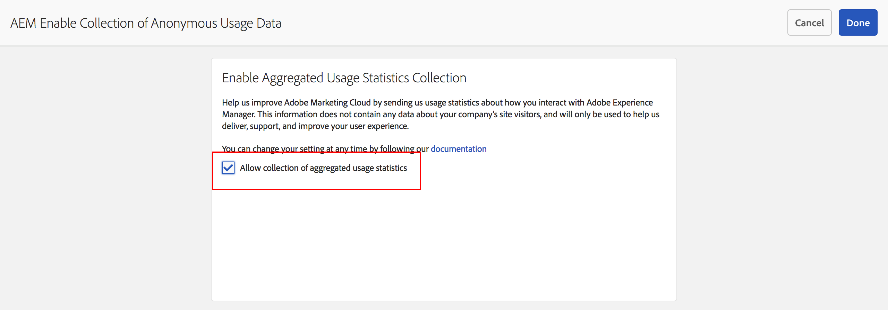
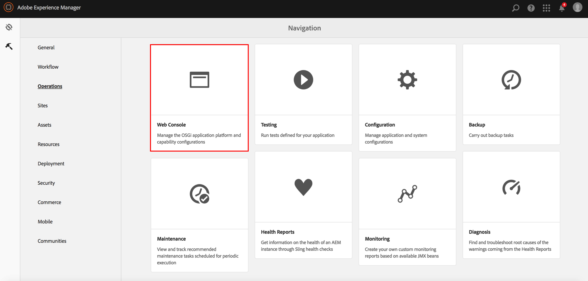

# Aceitar a coleção de estatísticas de uso agregadas{#opting-into-aggregated-usage-statistics-collection}

## Introdução {#introduction}

Você pode ajudar a melhorar a Adobe Experience Cloud enviando estatísticas do Adobe sobre como você interage com o Adobe Experience Manager (AEM). Estas informações não contêm dados sobre os visitantes do site da empresa e são usadas apenas para ajudar a Adobe a fornecer, suportar e melhorar a experiência do usuário.

Você pode aderir à coleção de estatísticas de uso usando a interface para toque ou o Console da Web.

>[!NOTE]
>
>Há várias regulamentações de proteção e privacidade de dados; incluindo, por exemplo, o GDPR e o CCPA. A AEM Sites está pronta para ajudar os clientes em suas obrigações de conformidade de proteção e privacidade de dados. Esta página orienta os clientes por meio de procedimentos de aceitação (ou recusa) da Coleta de Estatísticas de Uso Agregado.
>
>Para obter mais informações, consulte também o [Centro de privacidade da Adobe](https://www.adobe.com/br/privacy.html).

>[!NOTE]
>
>Você pode recusar a qualquer momento usando o [Console da Web]&#x200B;(/help/sites-deploying/opt-in-aggregated-usage-statistics.md#opt-in-by-using-the-web-console ou não selecionando a opção de aceitação na tela de aceitação do AEM.

## Aceitar usando a interface para toque {#opt-in-by-using-the-touch-ui}

Na primeira vez que iniciar o AEM, você poderá aceitar usando a interface para toque da seguinte maneira:

1. Na tela Navegação do AEM, clique no ícone **Caixa de entrada** (sino).

   

1. Na lista suspensa, clique em **Habilitar Coleta de Estatísticas de Uso Agregado**.

   

1. Na tela de aceitação, clique na opção **[!UICONTROL Permitir coleta de estatísticas de uso agregadas]**.

   

1. Clique em **Concluído**.

## Aceitar usando o console da Web {#opt-in-by-using-the-web-console}

Você pode aceitar (ou recusar) usando o Console da Web da seguinte maneira:

1. Na tela Navegação do AEM, clique em **Ferramentas** e depois em **Operações**.

   

1. Na janela Operações, clique em **Console da Web**.

   

1. Pesquise por **Coleção de Estatísticas de Uso Agregado**.
1. Clique no ícone **Editar**.

   

1. Marque a caixa de seleção **Habilitado**. Como alternativa, desmarque a caixa de seleção se desejar recusar a coleta de estatísticas de uso.

   

1. Clique em **Salvar**.
