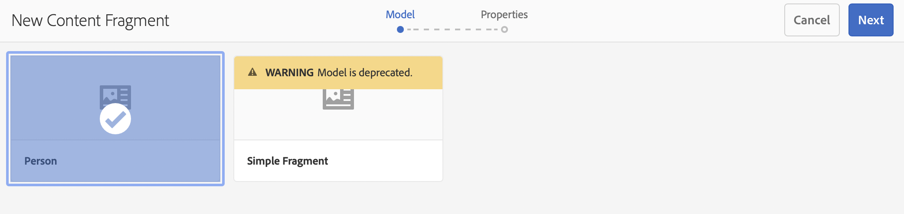

# Criação de fragmentos de conteúdo do Guia de início rápido do Headless {#creating-content-fragments}

Saiba como usar fragmentos de conteúdo do AEM para projetar, criar, preparar e usar conteúdo independente de página para entrega headless.

## O que são fragmentos de conteúdo? {#what-are-content-fragments}

[Agora que você criou uma pasta de ativos](create-assets-folder.md) onde você pode armazenar os fragmentos de conteúdo, é possível criar os fragmentos.

Os fragmentos de conteúdo permitem projetar, criar, preparar e publicar conteúdo independente de página. Eles permitem preparar conteúdo pronto para uso em vários locais e em vários canais.

Fragmentos de conteúdo contêm conteúdo estruturado e podem ser entregues no formato JSON.

## Como criar um fragmento de conteúdo {#how-to-create-a-content-fragment}

Os autores de conteúdo criarão qualquer quantidade de fragmentos de conteúdo para representar o conteúdo que eles criam. Esta será a principal tarefa deles no AEM. Para os propósitos deste guia de introdução, só será necessário criar um.

1. Faça logon no AEM e, no menu principal, selecione **Navegação > Assets**.
1. Navegue até a [pasta criada anteriormente.](create-assets-folder.md)
1. Clique em **Criar > Fragmento de conteúdo**.
1. A criação de um fragmento de conteúdo é apresentada como um assistente de duas etapas. Primeiro, selecione qual modelo deseja usar para criar o fragmento de conteúdo e clique em **Próximo**.
   * Os modelos disponíveis dependem da [**Configuração na nuvem** que foi definida para a pasta de ativos](create-assets-folder.md) na qual você está criando o fragmento de conteúdo.
   * Se você receber a mensagem `We could not find any models`, verifique a configuração da pasta de ativos.

   
1. Forneça o **Título**, **Descrição** e **Marcas** conforme necessário e clique em **Criar**.

   
1. Clique em **Abrir** na janela de confirmação.

   
1. Forneça os detalhes do fragmento de conteúdo no Editor de fragmento de conteúdo.

   
1. Clique em **Salvar** ou **Salvar e fechar**.

Os fragmentos de conteúdo podem fazer referência a outros fragmentos de conteúdo, permitindo uma estrutura de conteúdo aninhada, se necessário.

Fragmentos de conteúdo também podem fazer referência a outros ativos no AEM. [Esses ativos precisam estar armazenados no AEM](/help/assets/manage-assets.md) antes da criação de um fragmento de conteúdo de referência.

## Próximas etapas {#next-steps}

Agora que você criou um fragmento de conteúdo, poderá seguir para a parte final do guia de introdução e [criar solicitações de API para acessar e entregar fragmentos de conteúdo.](create-api-request.md)

>[!TIP]
>
>Para obter detalhes completos sobre o gerenciamento de fragmentos de conteúdo, consulte a [documentação dos Fragmentos de conteúdo](/help/assets/content-fragments/content-fragments.md)
