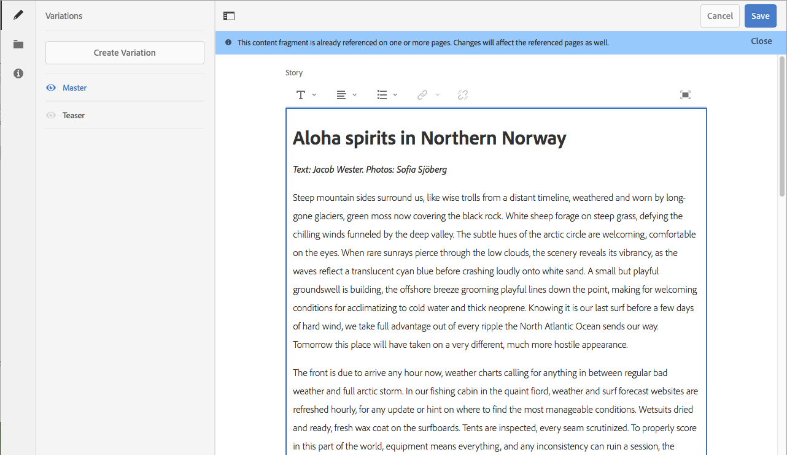
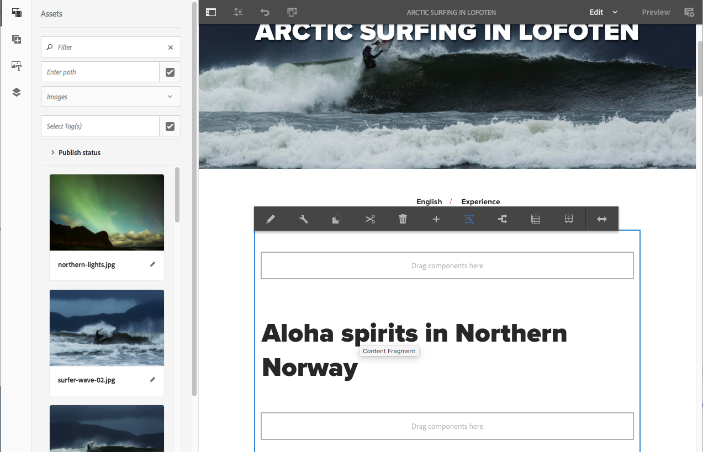

# Experimentar fragmentos de conteúdo no We.Retail{#trying-out-content-fragments-in-we-retail}

Os fragmentos de conteúdo permitem criar conteúdo não vinculado a canais, juntamente com variações (podem ser específicas de cada canal). O **We.Retail** (disponível em uma instância pronta para uso do Adobe Experience Manager) fornece o fragmento **Navegação ártica no Lofoten** como uma amostra básica. Isso ilustra que:

* Os fragmentos de conteúdo do Adobe Experience Manager (AEM) são [criados e gerenciados como ativos independentes da página](/help/assets/content-fragments/content-fragments.md). Eles permitem criar conteúdo não vinculado a canais, juntamente com variações (podem ser específicas de cada canal).

  * Consulte [Onde encontrar ativos de Fragmento de conteúdo no We.Retail](#where-to-find-content-fragments-in-we-retail)

* Em seguida, você pode [usar esses fragmentos e suas variações ao criar](/help/sites-authoring/content-fragments.md) suas páginas de conteúdo.

  * Consulte [Onde os fragmentos de conteúdo são usados em We.Retail](#where-content-fragments-are-used-in-we-retail)

Para obter a documentação completa sobre criação, gerenciamento, uso e desenvolvimento de fragmentos de conteúdo:

* Ver [Informações Adicionais](#further-information)

>[!NOTE]
>
>**Fragmentos de conteúdo** e **[fragmentos de experiência](/help/sites-authoring/experience-fragments.md)** são recursos diferentes no AEM:
>
>* **Fragmentos de conteúdo** são conteúdo editorial, principalmente texto e imagens relacionadas. Eles são conteúdo puro, sem design e layout.
>* **Fragmentos de experiência** são conteúdo totalmente apresentado; um fragmento de uma página da Web.
>
>Fragmentos de experiência podem incluir conteúdo na forma de Fragmentos de conteúdo, mas não o contrário.

## Onde encontrar fragmentos de conteúdo no We.Retail {#where-to-find-content-fragments-in-we-retail}

Há vários fragmentos de conteúdo de exemplo no We.Retail; navegue via **Assets**, **Arquivos**, **We.Retail**, **Inglês**, **Experiências**.

Isso inclui o **Surfe no Ártico no Lofoten**, um fragmento juntamente com ativos visuais relacionados:

* Navegue por meio do **Assets**, **Arquivos**, **We.Retail**, **Inglês**, **Experiências**, **Navegação Ártica no Lofoten**:

  * [http://localhost:4502/assets.html/content/dam/we-retail/en/experiences/arctic-surfing-in-lofoten](http://localhost:4502/assets.html/content/dam/we-retail/en/experiences/arctic-surfing-in-lofoten)

Você pode selecionar e editar o fragmento **Navegação no Ártico no Lofoten**:

* [http://localhost:4502/editor.html/content/dam/we-retail/en/experiences/arctic-surfing-in-lofoten/arctic-surfing-in-lofoten](http://localhost:4502/editor.html/content/dam/we-retail/en/experiences/arctic-surfing-in-lofoten/arctic-surfing-in-lofoten)

Aqui você pode [editar e gerenciar](/help/assets/content-fragments/content-fragments.md) o fragmento usando as guias (painel lateral esquerdo):

<!--  ASSET does not exist-->

* **[Variações](/help/assets/content-fragments/content-fragments-variations.md)** incluindo [Markdown](/help/assets/content-fragments/content-fragments-markdown.md)
* **[Conteúdo associado](/help/assets/content-fragments/content-fragments-assoc-content.md)**
* **[Metadados](/help/assets/content-fragments/content-fragments-metadata.md)**

## Onde os fragmentos de conteúdo são usados no We.Retail {#where-content-fragments-are-used-in-we-retail}

Para ilustrar a criação de [páginas com um fragmento de conteúdo](/help/sites-authoring/content-fragments.md), há vários exemplos de páginas fornecidos em, por exemplo:

* [http://localhost:4502/sites.html/content/we-retail/language-masters/en/experience](http://localhost:4502/sites.html/content/we-retail/language-masters/en/experience)

Por exemplo, o fragmento de conteúdo **Navegação no Ártico em Lofoten** é referenciado na página Sites:

* Navegue pelos **Sites**, **We.Retail**, **Idiomas principais**, **Inglês**, **Experiência**. Em seguida, abra o **Arctic Surfing in Lofoten** para edição:

  * [http://localhost:4502/editor.html/content/we-retail/language-masters/en/experience/arctic-surfing-in-lofoten.html](http://localhost:4502/editor.html/content/we-retail/language-masters/en/experience/arctic-surfing-in-lofoten.html)

## Informações adicionais {#further-information}

Para obter mais detalhes, consulte:

* [Trabalho com Fragmentos de conteúdo](/help/assets/content-fragments/content-fragments.md)

  * Saiba como criar, editar e gerenciar os ativos do Fragmento de conteúdo.

* [Criação de página com fragmentos de conteúdo](/help/sites-authoring/content-fragments.md)

  * Use seu fragmento de conteúdo ao criar uma página.

* [Desenvolvimento do AEM - Componentes para fragmentos de conteúdo](/help/sites-developing/components-content-fragments.md)

  * Uma visão geral dos componentes dos Fragmentos de conteúdo.

* [Desenvolvimento e extensão de fragmentos de conteúdo](/help/sites-developing/customizing-content-fragments.md)

  * Informações para ajudá-lo a desenvolver e estender fragmentos de conteúdo.
